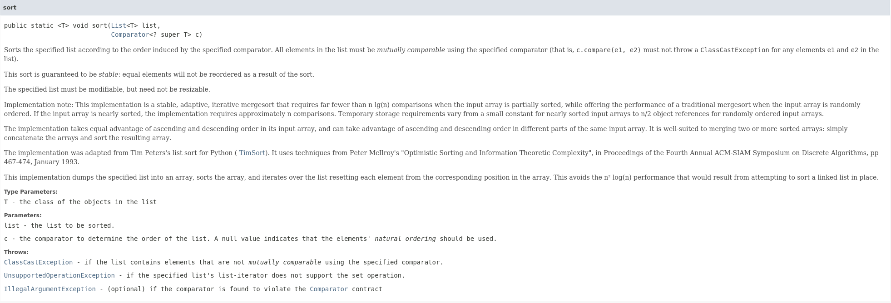
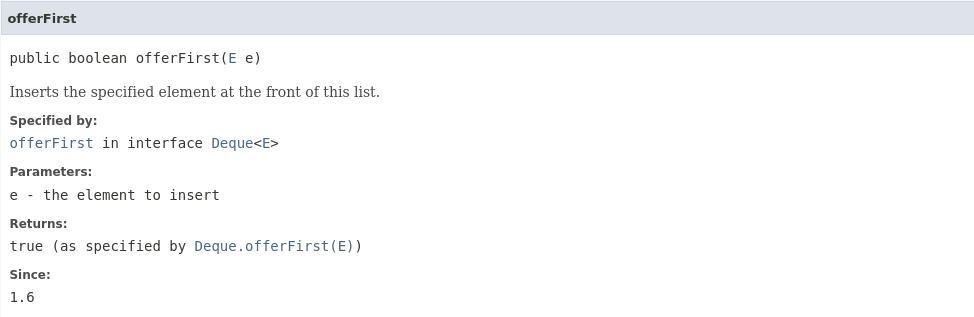

# Contents: 
* [Sorting in Java](#sorting_in_java)
- [Linked List in Java](#linked_list_in_java)
- [Arraylist vs LinkedList](#arraylist_vs_linkedlist)  
- [Inheritence in Generics](#inheritence_in_generics)

# Sorting in Java:
<a name='sorting_in_java'></a>

We all know how sorting works in primitive data types, but here we'll be looking at how to sort reference type of data, more precisely, custom reference type- like custom classes, etc.  
To achieve this, we'll be using a utility method from the `java.util.Collections` class. 

Collections utility class has an already implemented method- `sort()`. It takes a list as an argument and sorts the list in the ascending order. To sort any already provided class in Java like `java.lang.Integer`, the implementation is already written, but for any custom class, it'll give you a compile error.

There are two types of ordering/sorting in Java for custom classes:  
- Natural Ordering -> Sorting based on the primary key of the object(object identity)  
- Custom Ordering -> Sorting based on any other attribute of the object.  

## Natural Ordering for Custom classes:
Natural ordering means sorting based on the Object Identity of the classes. Therefore the implementation of this mechanism will be a part of the core class code. To implement natural ordering for custom created classes, the sort method we'll use is:   
  
In this method, the parameter of the function as a List with generic type T. And the the function signature shows that the type T has to implement `java.lang.Comparable` interface. Thus, to sort based on natural ordering, we have to implement Comparable interface in our custom class and that interface has only one method- `int compareTo(T o)`, which we'll have to override accoring to our class' primary key defination. More details about compareTo method are:  
  
Steps to implement sorting according to natural ordering:  
1. Implement Comparable interface in the user defined class.  
2. Override `compareTo()` method according to the primary key criteria.  
3. Define the method `compareTo()` according to the data type of the primary key, and return integers according to the below chart:

|compareTo criteria| return type|
| -------- | ------- |
| accountId < account.accountId | -1 |
| accountId == account.accountId | 0 |
| accountId > account.accountId | 1 |

Implementation:  
[BankAccount.java](./classwork/src/com/app/core/BankAccount.java)

In this implementation case, the primary key is a primitive type, so we had to define the comparing criteria. But for any already implemented classes, we'll just call the compareTo implementation of that class.  
Example of primitive implementation of `compareTo()` method:
```java
@Override
public int compareTo(BankAccount bankAccount) {
    if (this == bankAccount) return 0;
    if (accountId > bankAccount.accountId)
        return 1;
    else if (accountId < bankAccount.accountId)
        return -1;
    return 0;
}
```

Example of already provided classes' implementation of `compareTo()` method:
```java
@Override
public int compareTo(BankAccount bankAccount) {
    return registrationDate.compareTo(bankAccount.registrationDate);
}
```

### Limitations of Natural Ordering:
- You can implement sorting based on only one attribute.  
- For any other type, a change the defination is needed.  
- So, multiple sorting criteria cannot be implemented.  
- Any time sorting criteria is changed we have to change the core class, which is not considered as a good programming practise.

## Custom Ordering:
Sorting based on any other attribute of the Object identity of the class, and it's implementation doesn't affect the core class, as the sorting criteria is written outside of the core class.  
To implement this method we'll have to use another overloaded `sort()` method of `java.util.CollectionUtils()`:  
  
In this method, the first parameter is a list to sort and the other parameter is a reference of a class which describes the comparing criteria. And to describe this comparing criteria, it implements an interface called `java.lang.Comparator`. And override a method called `int compare()`. The return values is same as `compareTo()` method. More information about compare method:  
  

__NOTE:__ `compareTo()` method uses only one argument, but `compare()` method uses two arguments to impement custom ordering.  

This class is a generic type of interface which will take the custom class as it's type.  
So, we can either create a new class implementing this interface and pass a reference of that class, or we can create an anonymous inner class and pass it as a parameter and it's reference.  

### Implementing another class and passing it's reference:
Sorting accourding to the date of registration:
```java
public class AccountDateComparator implements Comparator<BankAccount> {

    @Override
    public int compare(BankAccount account1, BankAccount account2) {
        return account1.getDate().compareTo(account2.getDate());
    }
}

// Passing this refernce to sort method.
Collections.sort(list,new AccountDateComparator());
```
__NOTE:__ Here, we need to use getters as this code is written outside of the core class.  
The limitation with the above approach is we have to create a class for each attribute ordering criteria. Instead implmenting inner class mechanism gives a lot sleeker code.  
```java
Collections.sort(list, new Comparator<BankAccount>() {

  @Override
   public int compare(BankAccount a1,BankAccount a2) {
     return a1.getDate().compareTo(a2.getDate());
   }
});
```

__NOTE:__ As in case of annonymous inner classes, we're not passing the interface instance as a reference, as we cannot create a refernce of an interface. We are passing a reference of an anonymous class which implements the `Comparator<BankAccount>` interface.  
Implementation of this can be seen:  
[Test.java](./classwork/src/com/tester/Test.java)

The overall summary of ordering/sorting in Java:  


# Linked List in Java
<a name='linked_list_in_java'></a>

- Fully Qualified Class name: `java.util.LinkedList<E>`.  
- Doubly-linked list implementation of the List and Deque interfaces.  
- Traversal: for loop, for-each loop, Iterator, ListIterator.  
- It maintains order of insertion.  
- It supports index based operations.  
- Allows null values.  
- It does not implement RandomAccess interface.(ArrayList class does!)  
- So it represents sequential access list.  
- Best use-case when having a lot of insertions and deletion operations.  
- Not best when having index based searching operations, as ArrayList performs better in that scenario.  
- When we try to access an element from a LinkedList, searching that element starts from the beginning or end of the LinkedList based on whichever is closer to the specified index.(eg : list.get(i)).  
- It supports all of List API methods, as seen already in ArrayList.  

There are two types of Linked List:
- Sinlgly Linked List:  
  
- Double Linked List:  
  
  

List of Linked List overloaded constructors information:  
  


Linked List supports all the list methods and the following methods are specific to LinkedList class which are inherited from Deque interface:  
1. `void addFirst(E e)`:
- Inserts the specified element at the beginning of this list.
- <details><summary>More details</summary>

	
    </details>

2. `void addLast(E e)`:  
- Appends the specified element to the end of this list. 
- <details><summary>More details</summary>

	
    </details>

3. `E getFirst()`:  
- Returns the first element in this list.
- <details><summary>More details</summary>

	
    </details>

4. `E getLast()`:  
- Returns the last element in this list.
- <details><summary>More details</summary>

	
    </details>

5. `E remvoeFirst()`:  
- Removes and returns the first element from this list.
- <details><summary>More details</summary>

	
    </details>

6. `E removeLast()`:  
- Removes and returns the last element from this list.
- <details><summary>More details</summary>

	
    </details>

7. `boolean offer(E e)`:  
- Adds the specified element as the tail (last element) of this list.
- <details><summary>More details</summary>

	
    </details>

8. `boolean offerFirst(E e)`:  
- Inserts the specified element at the front of this list.
- <details><summary>More details</summary>

	
    </details>

9. `boolean offerLast(E e)`:  
- Inserts the specified element at the end of this list.  
- <details><summary>More details</summary>

	
    </details>

10. `E poll()`:  
- Retrieves and removes the head (first element) of this list.
- <details><summary>More details</summary>

	
    </details>

11. `E pollFirst()`:  
- Retrieves and removes the first element of this list, or returns null if this list is empty.
- <details><summary>More details</summary>

	
    </details>

12. `E pollLast()`:  
- Retrieves and removes the last element of this list, or returns null if this list is empty.
- <details><summary>More details</summary>

	
    </details>

13. `E peek()`:  
- Retrieves, but does not remove, the head (first element) of this list.  
- <details><summary>More details</summary>

	
    </details>

14. `E peekFirst()`:  
- Retrieves, but does not remove, the first element of this list, or returns null if this list is empty.  
- <details><summary>More details</summary>

	
    </details>

15. `E peekLast()`:
- Retrieves, but does not remove, the last element of this list, or returns null if this list is empty.  
- <details><summary>More details</summary>

	
    </details>

Linked list also supports the iterator, but there is also a special reverse iterator for Linked list:  
`Iterator<E> descendingIterator()`.  
For this, it'll use `boolean hasNext()` and ` E next()` methods, rather than using `boolean hasPrevious()` or `E previous()` methods.  
<details><summary>More details</summary>


</details>  
  

## Java Linked List Use-cases:
Best Usecase scenario:- When our frequently used operation is adding or removing elements in the middle of the List, LinkedList is the best class to use.  
Why? Because we don't need to do more shifts to add or remove elements at the middle of the list.  

Worst Usecase scenario:- When our frequently used operation is retrieving elements from list, then LinkedList is the worst choice.  
Why? Because LinkedList supports only sequential access, does NOT support random access.  

__NOTE:__ LinkedList implements List, Deque, But it does NOT implement RandomAccess interface.  

# ArrayList vs LinkedList:
<a name='arraylist_vs_linkedlist'></a>


# Inheritence in Generics
<a name='inheritence_in_generics'></a>

Inheritence in Generics is different then compared to normal class inheritence. For example, Employee(super class) is extended by Manager(sub class). So even though Manager is an Employee, Arraylist<Manager> is not a ArrayList<Employee>.  

__NOTE:__ This can be understood in detail by following a concept- __PECS__ (**P**roducer **E**xtends, **C**onsumer **S**upers). This is explained in detail in later chapters.  

Now for the above use-case, that is not done by default, but we might want a scenario where we want to add a Manager list into Employee list or a Worker list into an Employee list. For that we have to use inheritence in generics, which has special syntax -> `?`.  
`?` is a special character in generics which is known as Wildcard in Generics syntax.  
So, let's take the constructor of Arraylist as an example: `ArrayList(Collection<? extends E> C)`. Some points to note here:  
- If the generics is given as `?`, it means that it can contain anything -> Unbounded.  
- If the generics is given as `? extends E`, -> Specifies upper bound. Meaning -> Can create new populated ArrayList of type E, from ANY collection(ArrayList,LinkedList,Vector,HashSet,LinkedhashSet,TreeSet) of Type E or it's sub-type, i.e, anything that extends E. This can be any class below E in the hierarchy of E.  
- If the generics is given as `? super E`, -> Specifies lower bound. Meaning -> Can create new populated ArrayList of type E, from ANY collection(ArrayList,LinkedList,Vector,HashSet,LinkedhashSet,TreeSet) of Type E or any of it's super type.  

Uses:
```java
// Unboud:
List<?> l3=new LinkedList<Emp>();
l3=new LinkedList<Integer>();

// Upper Bound:
List<? extends Emp> l4=new Vector<>();
l4=new ArrayList<Mgr>();

// Lower Bound:
List<? super Mgr> l6=new ArrayList<>();
l6=new Vector<Emp>();
```

So, just as a basic understanding, the destination collection data type is a consumer, and the source is Producer. In the above example, Employee is a producer, and Manager or Worker is a producer.  
So, this means that we can add any type of data to the collection, which has extended the Producer class, i.e., Producer Extends, and Consumer Supers.

__NOTE:__ We can also look at the Ordering methods and definations now, and get more details now:  
__Natural ordering:__ `static <T extends Comparable<? super T>> void sort(T o)`. This means that in the sort method T -> must have implemented Comparable interface. And since Comparable is a generic interface, it also needs to be given what all types of Comparable implementations should work. So, the generic rules for Comparable states that we can only pass such a list that has implemented the Comparable interface, i.e., the core class should have implemented the same type of Comparable interface.