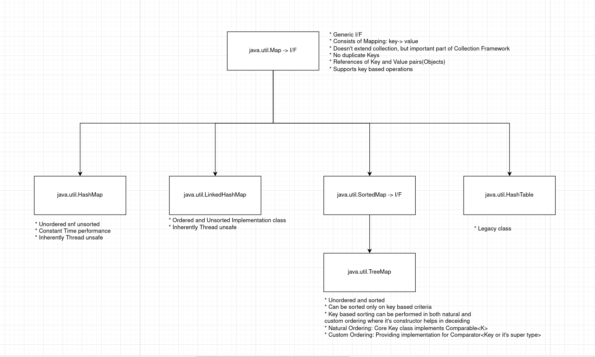

# Contents

- [Map](#map_interface)
- [Hashmap](#hashmap)

## Map Collection

<a name='map_interface'> </a>

Map and it's hierarchy is not a part of the collection hierarchy, but it is considered as one of the most important data structures of the Collection framework. The overall summary of the Map hierarchy is:  


__NOTE:__ No for/for-each/iterators in map, as it is not part of the Iterable hierarchy.  

__NOTE:__ Map is an interface and there is a static interface nested in it called as entry, which is a pair of key and value as a whole.  

### Map interfaces API

1. `public Object put(K key, V value)`:

    - Inserts value in a map:
      - New Entry: inserts and return null.
      - Existing Entry: replaces the old value with new value and returns the old value referencee.

2. `public Object putIfAbsent(K key, V value)`:

    - Inserts value in a map:  
      - New Entry: inserts and return null.  
      - Existing Entry: doesn't replace the old value, and returns the old value reference.

3. `public V remove(K key)`:

    - If found: removes the value from the map and return it's reference.
    - If not found: returns null

4. `public void putAll(Map <<? extends K>, <? extends V>> mapping)`:

    - Add all the key value mapping pairs in the Map on which the putAll method is called.

5. `public void clear()`:

    - Empties the Map.

6. `public V get(Object Key)`:

    - Returns the value corresponding to the key.
    - Returns null if key not present.

7. `public boolean containsKey(Object key)`:

    - Returns true/false based on whether the key is present or not.

8. `public boolean containsValue(Object vavle)`:

    - Returns true/false based on whether the value is present or not.

9. `public int size()`:

    - Returns the number of key-value mappings in the map.

10. `public boolean isEmpty()`:

    - Returns true/false if value present or not.

11. `default void foreach(Biconsumer<? super K, ? super V> action)`

## HashMap

<a name='hashmap'></a>

__NOTE:__ If we are in a need of searching data and need a contant time performance, HashMap is best for that use-case. Almost all J2EE datastructures are created using HashMap or some specialised version of it.  

Some features of HashMap are:

1. un-sorted(not sorted as per Natural ordering or custom ordering based criteria) & un-ordered(doesn't remember order of insertion) map implementation class.  
2. No duplicate keys.  
3. Guarantees constant time performance -> uses hashing algorithm. Has two properties -> initial capacity(16 by default)- number of buckets created initially and load factor- criteria for re-hashing..  
4. Allows null key reference(once).  
5. Inherently thread unsafe.  

### HashMap Constructors


HashMap implements all the methods of Map interface, and behave more or less the same how Map behaves. All the methods listed above are also inherited by HashMap, and thus can be used for operations on HashMap.

To Iterate over the elements of a Map, we have three options:

- `Set<K> keySet()`:
  Returns a Set view of the keys contained in this map, which can be iterate over.

- `Collection<V> values()`:
  Returns a Collection view of the values contained in this map, which can iterated over.

__NOTE:__ The reason why the above is a Set of Keys and a Collection of Values is because Keys are unique and values can be duplicate. Since Set doesn't allow duplicate values, it is best Collection implementing class to store Keys.

- `Set<Map.Entry<K, V>> entrySet()`:
  Returns a Set view of the mappings contained in the map. This is used when both key and values are needed.
  
  __NOTE:__ The Map.Entry is a statically nested interface of the Map Interface, as the implementation suggests: `Map.Entry`

  To use the keys and values in the entryset, we'll have to use:
  
  - `K getKey()`:
    Returns the Key corresponding to this entry.

  - `V getValue()`:
    Returns the value corresponding to this entry.

__NOTE:__ The above iteration method was the only available method to iterate over a Map till Java 7, where we had to convert a Map implementing class to a Collection and then iterate over it.

### Limitations of HashMap

- Cannot be sorted based on Value vased criteria.

- Have to convert to a TreeMap, if sorting is needed on Key based criteria.

### Iterating over a Map

```java
Map<Integer, BankAccount> hashMap = CollectionUtils.populateMap();
Set<Integer> keys = hashMap.keySet();

// Iterating over keys:
System.out.println("Keys: ");
for (int i: keys)
  System.out.print(i + " ");

// Iterating over values:
System.out.println("Values: ");
for (BankAccount account: hashMap.values())
  System.out.println(account);

// Iterating over entries- key and value pair:
System.out.println("Entries: ");
for (Entry<Integer, BankAccount> entry: hashMap.entrySet())
  System.out.printf("Key: %d : Value %s.", entry.getKey(), entry.getValue());
```

__NOTE:__ `equals()` and `==` are interchangeable as Enum equality is based on its ordinal equality.

```java
if (acc.getType() == AccountType.SAVINGS)
  acc.applyInterest(rate);
```

### Sorting in Maps

To figure out which method to implement when sorting, we must find out whether to sort based on key or value. If it's Key based sorting, it can be done easily by converting it a sorted Map, ie., TreeMap, and the sorting will be done. If it's based on value or an attribute of a value, then we have to convert the values into a collection and perform the sorting based on Natural or Custom ordering, like we have done earlier.

## TreeMap


__NOTE:__

- When creating an empty TreeMap using the constructor `TreeMap()` or a populated TreeMap using the constructor `TreeMap(Map<? extends K, ? extends V> map)`, the sorting will be done according to the key based criteria when putting a new entry to the map or creating the map. Thus, for sorting, the key class must imeplement `java.util.Comparable<T>` interface and so, override `public int compareTo(T t)` method.

- When wanting to implement the custom ordering of Keys, we must choose `TreeMap(Comparator<? super K> comparator)` constructor. And thus can be implemented using either an anonymous inner class or a lambda function. This will create an empty TreeMap, and whenever we make a new entry to the TreeMap, it'll be sorted accordingly defined the by rules passed in the constructor.

__NOTE:__ When doing the sorting of values, we have to convert it to a Collection:

```java
// Sorting based on BankAccount Balance
ArrayList<BankAccount> list = new ArrayList<>(hashMap.values());
Collections.sort(list, new Comparator<BankAccount>() {
    @Override
    public int compare(BankAccount o1, BankAccount o2) {
        return ((Double) o1.getBalance()).compareTo((Double) o2.getBalance());
    }
});
System.out.println("Sorted Map according to the Account Balances:");
for (BankAccount account1: list)
    System.out.println(account1);
```

In the above scenario, we cannot just use `hashMap.values()` in the `Collections.sort()` method because it'll give a Collection and we need a sortable collection. So, any sortable collection, like, Arraylist is a Collection, but a Collection is not an ArrayList. Thus, it'll give the compiler error. So, we have two options:

```java
ArrayList<BankAccount> list = new ArrayList<>(hashMap.values());
Collections.sort(list, ...);
```

Or

```java
Collections.sort((List<BankAccount> /** OR */ Arraylist<BankAccount>)hashMap.values(), ...);
```

But typecasting to `Collection<BankAccount>` doesn't work, as a List/Arraylist is a sortable collection, but Collection is not.
