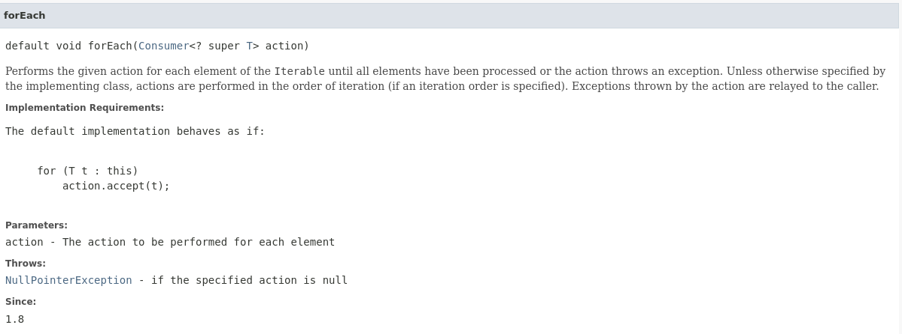
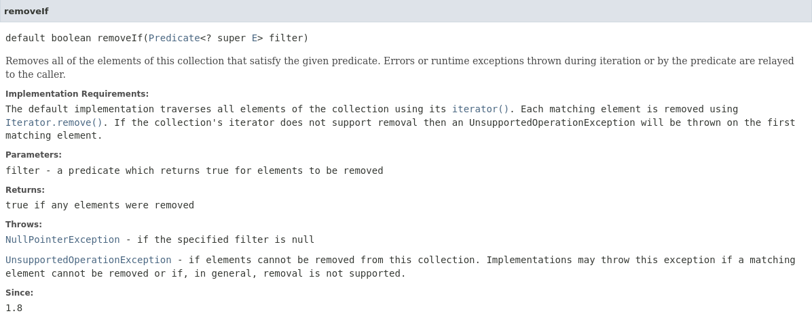

# Contents

- [Type erasure with Generics](#type_erasure_with_generics)
- [Java 8 Features](#java_8_features)

## Type erasure with generics

<a name='type_erasure_with_generics'></a>

Generics was added to provide type-checking at compile time and it has no use at run time, so java compiler uses type erasure feature to remove all the generics type checking code in byte code and insert type-casting if necessary. Type erasure ensures that no new classes are created for parameterized types; thus unlike c++ templates , generics incur no code bloating.

For example if we have a generic class like below;

```java
public class Test<T> {

    private T data;
    public Test(T d) {
        this.data = d;
       
    }

    public T getData() { return this.data; }
}
```

-------------

```java
public class Test<T extends Comparable<T>> {

    private T data;
    public Test(T d) {
        this.data = d;
    }

    public T getData() { return this.data; }
}
```

### What will the above code be in byte code?

The Java compiler replaces the bounded type parameter T with the first bound interface, Comparable, as below code:

```java
public class Test {

    private Comparable data;
    public Test(Comparable d) {
        this.data = d;
    }

    public Comparable getData() { return data; }
}
```

## Java 8 Features

<a name='java_8_features'></a>

### Addition of `default` keyword to add default method implementation, in interfaces

Java 8 enables us to add non-abstract(concrete) method implementations to interfaces by utilizing the default keyword. This feature is also known as Extension Methods.

#### Why default keyword ?

1. To maintain backward compatibility with earlier Java SE versions, so the implementing class of this i/f doesn't have to provide the defination for every newly implemented functionality.
2. To avoid implementing new functionality in all implementation classes.
eg : Java added in `Iterable<T>` interface `default void forEach(Consumer<? super T> action)` as a default method implementation

eg :

```java
interface Formula {
    double calculate(double a);

    default double sqrt(double a,double b) {
        return Math.sqrt(a+b);
    }
}
```

__NOTE:__ The default method can be overriden as well, if a change to the defination is needed. In case of ambiguity or to refer to default implementation from i/f -> use `InterfaceName.super.methodName(...)` syntax.
e.g.:

```java
// Interface:
public interface Formula {

    //public abstract
    double calculateSquare(double number);
    //public
    default double calculateSquareRoot(double number) {
        return Math.sqrt(number);
    }
}

// Implementing Class:
public class MyFormula implements Formula {
    
    @Override
    public double calculateSquare(double number) {
        return number * number;
    }

    @Override
    public double calculateSquareRoot(double number) {
        System.out.println("Printing Square root using the default function.");

        // Calling the interface's default method using the super keyword.
        return Formula.super.calculateSquareRoot(number);
    }
}
```

__NOTE:__ When we have two duplicate default methods in two or more interfaces and are implemented by a class, then an ambiguity arises as to which method to choose. So, in this case the implementing class must override the method, and in the defination of the overridden method, it can call the intended default method.
e.g.:

```java
//Interface 1:
public interface Formula1 {

    //public abstract
    double calculateSquare(double number);

    // public
    default double calculateSquareRoot(double number) {
        System.out.println("Formula 1 default mehtod.");
        return Math.sqrt(number);
    }
}

//Interface 2:
public interface Formula2 {

    //public abstract
    double calculateSquare(double number);

    // public
    default double calculateSquareRoot(double number) {
        System.out.println("Formula 2 default mehtod.");
        return Math.sqrt(number);
    }
}

//Implementing class:
public class MyFormula implements Formula1, Formula2 {

    //Overriding it once works because, this method will work as implementation of both the abastract mehtods.
    @Override
    public double calculateSquare(double number) {
        return number * number;
    }

    //Mandatory to override this to remove ambiguity.
    @Override
    public double calculateSquareRoot(double number) {
        return Formula1.super.calculateSquareRoot(number);
    }
}

```

__NOTE:__ For two interfaces, if they have methods with same signature, we can override just one method, which will server as the implementation of both the methods. But if the signature is same, and the return type is different of those two methods, it will not work as they are incompatible.

### Can add static methods in Java Interfaces

- It's a better alternative to writing static library methods in helper class(e.g. Arrays or Collections).
- Such static methods can't be overridden in implementation class. BUT can be re-declared.
- They have to be invoked using interface ref , even in implementation or non implementation classes.

Example:

```java
//Interface:
public interface Formula {

    //public static final
    int data = 5;

    //public abstract
    double calculateSquare(double number);

    //public
    default double calculateSquareRoot(double number) {
        System.out.println("Default method impementation");
        return Math.sqrt(number);
    }

    //public
    static void show() {
        System.out.println("Interface's Static method invoded.");
    }
}

//Implementing class:
public class MyFormula {

    @Override
    public double calculateSquare(double number) {
        System.out.println("Overridden calculateSquare method");
        return number * number;
    }

    @Override
    public double calculateSquareRoot(double number) {
        System.out.println("Overridding Default method.");
        return Formula.super.calculateSquareRoot(number);
    }

    //@Override -> Error, as static method cannot be overrridden.
    //This is redeclaring the method.
    public static void show() {
        System.out.println("Class's static method invoked.");
    }
}
```

To use the above two static methods, we'll have to use: `<classname/interfacename>.<methodName>()`. Example:

```java
public class TestDefMethods {
    public static void main(String[] args) {
        Formula f = new MyFormula();    //Upcasting -> Interface's reference can store implmenting class' object.
        System.out.println(f.calculateSquare(10));
        /*
        O/P:
        Overridden calculateSquare method
        100
        */
        
        System.out.println(f.calculateSquareRoot(100));
        /*
        O/P:
        Overridding Defualt method.
        Default method implementation
        10
        */

        f.show();   //Compiler error, as we cannot call a static method as a reference to an object.

        MyFormula.show();
        /*
        O/P:
        Class's static method invoked.
        */

        Formula.show();
        /*
        O/P:
        Interface's Static method invoded.
        */
    }
}
```

### Functional Interfaces

An interface which has exactly one abstract method is called functinal interface. eg Runnable,Comparable,Comparator,Iterable,Consumer,Predicate... It can have the rest of the methods as default or static.

__New annotation introduced:__ `@FunctionalInterface`

Only Functional interface instances  can be created with lambda expressions, method references, or constructor references.

Let's look at how functional interface are used:

```java
@FunctionalInterface
public interface Computable {
  double compute(double d1,double d2);
}
```

All it's implementing classes are:

```java
// Implementing class 1:
public class Adder implements Computable {

    @Override
    public double compute(double d1, double d2) {
    // TODO Auto-generated method stub
    return d1+d2;
    }
}

// Implementing class 2:
public class Multiplier implements Computable {

    @Override
    public double compute(double d1, double d2) {
        // TODO Auto-generated method stub
        return d1*d2;
    }
}

// Implementing class 3:
public class Subtractor implements Computable {

    @Override
    public double compute(double d1, double d2) {
        // TODO Auto-generated method stub
        return d1-d2;
    }
}
```

Tester class for using all the above classes:

```java
public class Test {

    public static void main(String[] args) {
        System.out.println(testCompute(10, 20, new Adder()));
        System.out.println(testCompute(10, 20, new Multiplier()));
        System.out.println(testCompute(10, 20, new Subtractor()));

    }

    //static method which will accept i/p num1(double), num2(double), behaviour
    public static double testCompute (double a, double b, Computable ref) {
        return ref.compute(a, b);
    }

}
```

The above code is very redundant as we have to write a class specifically for providing the defination of the Computable Inteface. This was the only way to do this till Java SE 7, but this can be replaced by providing the reference of an inner class like we did in `Collection.sort(list, <object ref of Comparator i/f implemented inner class>);`. The same can be achieved with the earlier program:

```java
@FunctionalInterface
public interface Computable {
    //abstract
    public double compute(double number1, double number2);
}
```

The tester class will change like this:

```java
public class Test {

    public static void main(String[] args) {
        System.out.println("Addition: " + testCompute(10, 20, new Computable() {

            @Override
            public double compute(double number1, double number2) {
                return number1 + number2;
            }
        }));

        System.out.println("Subtraction: " + testCompute(10, 20, new Computable() {

            @Override
            public double compute(double number1, double number2) {
                return number1 - number2;
            }
        }));

        System.out.println("Multiplication: " + testCompute(10, 20, new Computable() {

            @Override
            public double compute(double number1, double number2) {
                return number1 * number2;
            }
        }));
    }

    public static double testCompute(double number1, double number2, Computable ref) {
        return ref.compute(number1, number2);
    }
}
```

The above code will work, but this too is a very expressive way of writing methods. If it is a functional interface then JVM knows which method needs to be overridden, so we shouldn't have to give information that we're overriding the only method in the interface.

__NOTE:__ Only Functional interface instances can be created with lambda expressions, method references, or constructor references.

This can be overcome by using lambda expressions. It's main benefit is to provide more readable, maintainable, clean & consise code.

### Lambda Expressions

#### Benefits of lambda expresssions

1. To enable functional programming.
    Functions as a first class citizens. Meaning, using lambdas You can:
    1. define anonymous functions
    2. assign a function to a variable
    3. pass function as a parameter
    4. return function as a return value
2. To write more readable , maintainable , clean & concise code.
3. To use APIs easily n effectively.
4. To enable parallel processing

#### Background

Java is an object-oriented language. With the exception of primitive data types, everything in Java is an object. Even an array is an Object. Every class creates instances that are objects. There is no way of defining just a method which stays in Java all by itself. There is no way of passing a method as argument or returning a method body for that instance i.e passing the behaviour was not possible till java 8.

It was slightly possible using anonymous inner classes, but that still required us to write a class!

#### What is lambda expression?

Concise anonymous function which can be passed around. It has:

1. List of parameters.
2. Body.
3. Return type.

Lambda expressions in Java are usually written using syntax `(argument) -> { body }`. For example:

```java
(type1 arg1, type2 arg2...) -> { body }
```

Following are some examples of Lambda expressions.

```java
(int a, int b) -> {  return a + b; }

// OR can be reduced to 
(int a, int b) ->  a + b

// OR further can be reduced to
(a,b) -> a+b
 

() -> System.out.println("Hello World");
 
(s) -> { System.out.println(s); }

// This is equivalent to () -> { return 42;} 
() -> 42
 
// This can be replaced with () -> 3.1415
() -> { return 3.1415; }
```

__NOTE:__ For most of the cases, JavaC is able to infer what type of arguments lambdas receive it's not necessary to use them.

Above is just a syntax of lambda . _But how to use them?_ Answer is -> You can use lambda expressions as targets of  functional i/f reference. The reason is if you're using a non-functional interface, JVM won't be able to deduce which mehtod you're overriding.

So, the above program can be replaced with the below code:

```java
//Interface:
@FunctionalInterface
public interface Computable {
    //abstract
    public double compute(double number1, double number2);
}

//Tester class using the functional interface as lambda expression:
public class Test {

    public static void main(String[] args) {
        System.out.println("Addition: " + testCompute(10, 20, ((number1, number2) -> number1 + number2)));
        System.out.println("Subtraction: " + testCompute(10, 20, ((number1, number2) -> number1 - number2)));
        System.out.println("Multiplication: " + testCompute(10, 20, ((number1, number2) -> number1 * number2)));
    }

    public static double testCompute(double number1, double number2, Computable ref) {
        return ref.compute(number1, number2);
    }
}
```

To extend this further, we can add generics to the mix:

```java
//Interface:
@FunctionalInterface
public interface Computable <T>{
    public T compute(T number1, T number2);
}

//Tester class using the functional interface as lambda expression:
public class Test {

    public static void main(String[] args) {

        System.out.println("Addition is: " + testCompute(10, 20, ((number1, number2) -> number1 + number2)));
        System.out.println("Subtraction is: " + testCompute(10, 20, ((number1, number2) -> number1 - number2)));
        System.out.println("Multiplication is: " + testCompute(10, 20, ((number1, number2) -> number1 * number2)));
    }

    public static <T> T testCompute(T number1, T number2, Computable<T> ref) {
        return ref.compute(number1, number2);
    }
}
```

__NOTE:__ In the above code, the method which accepts the behaviour of another method as an argument, it is called as __Higher Order Function__, which is a crucial/key feature of the functional programming. The method or lambda expression which we're passing is called an __anonymous function__.

### Iterable Interface API

`java.lang.Iterable` interface an API method: `default void forEach(Consumer<? super T> action)`. So, this method can be implemented/called on any of the List implementing class. The type of parameter itself is a functional interface- Consumer.

More details of the method are:


So, using forEach method, we can perform the action specified by it's functional class on all the elements of the Collection which implements the Iterable interface.

The functional method of the Consumer interface is `void accept(T t)`. This method is used to perform any action on type T. So, all in all the method is to be used as below:

Example:

```java
List<Integer> l1 = Arrays.asList(1, 2, 3, 56, 43, 567);
l1.forEach(new Consumer<Integer>() {
    @Override
    public void accept(Integer t) {
        System.out.println(t);
    }
});

//Making it to a more concise method: lambda
l1.forEach(i -> System.out.println(i));
```

__NOTE:__ Since Java 8 all the functional interfaces have been added to a different package: `java.util.function` package.

### Another important use of Lambda Expressions

```java
// Populating the list
List<BankAccount> l1 = populateData();

// Displaying all elements of the list using forEach lambda
l1.forEach(a -> System.out.println(a));

// sort accounts as per date -> Custom Ordering using anonymous inner class.
System.out.println("Sorted list using anonymous inner class");
Collections.sort(l1, new Comparator<BankAccount>() {
    @Override
    public int compare(BankAccount o1, BankAccount o2) {
        // TODO Auto-generated method stub
        return o1.getCreationDate().compareTo(o2.getCreationDate());
    }
});

//Printing the sorted list
l1.forEach(a -> System.out.println(a));

// Sorting accounts as per date -> Custom Ordering using lambda expression
Collections.sort(l1, (a1, a2) -> a1.getCreationDate().compareTo(a2.getCreationDate()));
l1.forEach(a -> System.out.println(a));
```

### Important Functional Interface used in Collection: `java.util.function.Predicate`

`java.util.function.Predicate` is a functional interface which has a functional method as `boolean Test(T t)`. This method is similar to that of accept, which performs some action, whereas test gives either true or false based on whether the argument we passed matches the condition described in the body of the test method.

The most important use of Predicate interface is used in removeIf method of Collection Interface. Method description:


So, an instance of the Predicate implementing class is used as a filter to remove elements from the Collection. Since it is a functional interface, it can be implemented using either an anonymous inner class or a lambda expression.

```java
// Populating the Collection or more specifically a List.
List<BankAccount> l1 = populateData();

// Display all elements of the list using lambda
l1.forEach(a -> System.out.println(a));

// Setting the date as a limiter.
Date d1 = sdf.parse("1/1/2017");

// Remove all accounts created before specified date- using anonymous inner class.
l1.removeIf(new Predicate<BankAccount>() {
    @Override
    public boolean test(BankAccount t) {
        return t.getCreationDate().before(d1); 
    }
}); 

// Printing the elements after removal
System.out.println("post remove : ");
l1.forEach(a ->System.out.println(a));

// Setting the date as a limiter
d1 = sdf.parse("1/1/2018");

// Remove all accounts created before specified date- using lambda expression.
l1.removeIf(a -> a.getCreationDate().before(d1));

// Printing the elements after removal
System.out.println("post remove");
l1.forEach(a -> System.out.println(a));
```

__NOTE:__ There is a special method `removeIf()` in Collection interface to remove while iterating the Collection because you cannot remove elements while iterating over a Collection using for-each loop or index based for loop because it'll give `java.lang.ConcurrentModificationException` since for-each itself is an implicit iterator and when removing we're structurally modifying the Collection.
