# Contents

- [Type erasure with Generics](#type_erasure_with_generics)
- [Java 8 Features](#java_8_features)
- [Java I/O](#java_io)

## Type erasure with generics

<a name='type_erasure_with_generics'></a>

Generics was added to provide type-checking at compile time and it has no use at run time, so java compiler uses type erasure feature to remove all the generics type checking code in byte code and insert type-casting if necessary. Type erasure ensures that no new classes are created for parameterized types; thus unlike c++ templates , generics incur no code bloating.

For example if we have a generic class like below;

```java
public class Test<T> {

    private T data;
    public Test(T d) {
        this.data = d;
       
    }

    public T getData() { return this.data; }
}
```

-------------

```java
public class Test<T extends Comparable<T>> {

    private T data;
    public Test(T d) {
        this.data = d;
    }

    public T getData() { return this.data; }
}
```

### What will the above code be in byte code?

The Java compiler replaces the bounded type parameter T with the first bound interface, Comparable, as below code:

```java
public class Test {

    private Comparable data;
    public Test(Comparable d) {
        this.data = d;
    }

    public Comparable getData() { return data; }
}
```

## Java 8 Features

<a name='java_8_features'></a>

### Addition of `default` keyword to add default method implementation, in interfaces

Java 8 enables us to add non-abstract(concrete) method implementations to interfaces by utilizing the default keyword. This feature is also known as Extension Methods.

#### Why default keyword ?

1. To maintain backward compatibility with earlier Java SE versions, so the implementing class of this i/f doesn't have to provide the defination for every newly implemented functionality.
2. To avoid implementing new functionality in all implementation classes.
eg : Java added in `Iterable<T>` interface `default void forEach(Consumer<? super T> action)` as a default method implementation

eg :

```java
interface Formula {
    double calculate(double a);

    default double sqrt(double a,double b) {
        return Math.sqrt(a+b);
    }
}
```

__NOTE:__ The default method can be overriden as well, if a change to the defination is needed. In case of ambiguity or to refer to default implementation from i/f -> use `InterfaceName.super.methodName(...)` syntax.
e.g.:

```java
// Interface:
public interface Formula {

    //public abstract
    double calculateSquare(double number);
    //public
    default double calculateSquareRoot(double number) {
        return Math.sqrt(number);
    }
}

// Implementing Class:
public class MyFormula implements Formula {
    
    @Override
    public double calculateSquare(double number) {
        return number * number;
    }

    @Override
    public double calculateSquareRoot(double number) {
        System.out.println("Printing Square root using the default function.");

        // Calling the interface's default method using the super keyword.
        return Formula.super.calculateSquareRoot(number);
    }
}
```

__NOTE:__ When we have two duplicate default methods in two or more interfaces and are implemented by a class, then an ambiguity arises as to which method to choose. So, in this case the implementing class must override the method, and in the defination of the overridden method, it can call the intended default method.
e.g.:

```java
//Interface 1:
public interface Formula1 {

    //public abstract
    double calculateSquare(double number);

    // public
    default double calculateSquareRoot(double number) {
        System.out.println("Formula 1 default mehtod.");
        return Math.sqrt(number);
    }
}

//Interface 2:
public interface Formula2 {

    //public abstract
    double calculateSquare(double number);

    // public
    default double calculateSquareRoot(double number) {
        System.out.println("Formula 2 default mehtod.");
        return Math.sqrt(number);
    }
}

//Implementing class:
public class MyFormula implements Formula1, Formula2 {

    //Overriding it once works because, this method will work as implementation of both the abastract mehtods.
    @Override
    public double calculateSquare(double number) {
        return number * number;
    }

    //Mandatory to override this to remove ambiguity.
    @Override
    public double calculateSquareRoot(double number) {
        return Formula1.super.calculateSquareRoot(number);
    }
}

```

__NOTE:__ For two interfaces, if they have methods with same signature, we can override just one method, which will server as the implementation of both the methods. But if the signature is same, and the return type is different of those two methods, it will not work as they are incompatible.

### Can add static methods in Java Interfaces

- It's a better alternative to writing static library methods in helper class(e.g. Arrays or Collections).
- Such static methods can't be overridden in implementation class. BUT can be re-declared.
- They have to be invoked using interface ref , even in implementation or non implementation classes.

Example:

```java
//Interface:
public interface Formula {

    //public static final
    int data = 5;

    //public abstract
    double calculateSquare(double number);

    //public
    default double calculateSquareRoot(double number) {
        System.out.println("Default method impementation");
        return Math.sqrt(number);
    }

    //public
    static void show() {
        System.out.println("Interface's Static method invoded.");
    }
}

//Implementing class:
public class MyFormula {

    @Override
    public double calculateSquare(double number) {
        System.out.println("Overridden calculateSquare method");
        return number * number;
    }

    @Override
    public double calculateSquareRoot(double number) {
        System.out.println("Overridding Default method.");
        return Formula.super.calculateSquareRoot(number);
    }

    //@Override -> Error, as static method cannot be overrridden.
    //This is redeclaring the method.
    public static void show() {
        System.out.println("Class's static method invoked.");
    }
}
```

To use the above two static methods, we'll have to use: `<classname/interfacename>.<methodName>()`. Example:

```java
public class TestDefMethods {
    public static void main(String[] args) {
        Formula f = new MyFormula();    //Upcasting -> Interface's reference can store implmenting class' object.
        System.out.println(f.calculateSquare(10));
        /*
        O/P:
        Overridden calculateSquare method
        100
        */
        
        System.out.println(f.calculateSquareRoot(100));
        /*
        O/P:
        Overridding Defualt method.
        Default method implementation
        10
        */

        f.show();   //Compiler error, as we cannot call a static method as a reference to an object.

        MyFormula.show();
        /*
        O/P:
        Class's static method invoked.
        */

        Formula.show();
        /*
        O/P:
        Interface's Static method invoded.
        */
    }
}
```

### Functional Interfaces

An interface which has exactly one abstract method is called functinal interface. eg Runnable,Comparable,Comparator,Iterable,Consumer,Predicate... It can have the rest of the methods as default or static.

__New annotation introduced:__ `@FunctionalInterface`

Only Functional interface instances  can be created with lambda expressions, method references, or constructor references.

Let's look at how functional interface are used:

```java
@FunctionalInterface
public interface Computable {
  double compute(double d1,double d2);
}
```

All it's implementing classes are:

```java
// Implementing class 1:
public class Adder implements Computable {

    @Override
    public double compute(double d1, double d2) {
    // TODO Auto-generated method stub
    return d1+d2;
    }
}

// Implementing class 2:
public class Multiplier implements Computable {

    @Override
    public double compute(double d1, double d2) {
        // TODO Auto-generated method stub
        return d1*d2;
    }
}

// Implementing class 3:
public class Subtractor implements Computable {

    @Override
    public double compute(double d1, double d2) {
        // TODO Auto-generated method stub
        return d1-d2;
    }
}
```

Tester class for using all the above classes:

```java
public class Test {

    public static void main(String[] args) {
        System.out.println(testCompute(10, 20, new Adder()));
        System.out.println(testCompute(10, 20, new Multiplier()));
        System.out.println(testCompute(10, 20, new Subtractor()));

    }

    //static method which will accept i/p num1(double), num2(double), behaviour
    public static double testCompute (double a, double b, Computable ref) {
        return ref.compute(a, b);
    }

}
```

The above code is very redundant as we have to write a class specifically for providing the defination of the Computable Inteface. This was the only way to do this till Java SE 7, but this can be replaced by providing the reference of an inner class like we did in `Collection.sort(list, <object ref of Comparator i/f implemented inner class>);`. The same can be achieved with the earlier program:

```java
@FunctionalInterface
public interface Computable {
    //abstract
    public double compute(double number1, double number2);
}
```

The tester class will change like this:

```java
public class Test {

    public static void main(String[] args) {
        System.out.println("Addition: " + testCompute(10, 20, new Computable() {

            @Override
            public double compute(double number1, double number2) {
                return number1 + number2;
            }
        }));

        System.out.println("Subtraction: " + testCompute(10, 20, new Computable() {

            @Override
            public double compute(double number1, double number2) {
                return number1 - number2;
            }
        }));

        System.out.println("Multiplication: " + testCompute(10, 20, new Computable() {

            @Override
            public double compute(double number1, double number2) {
                return number1 * number2;
            }
        }));
    }

    public static double testCompute(double number1, double number2, Computable ref) {
        return ref.compute(number1, number2);
    }
}
```

The above code will work, but this too is a very expressive way of writing methods. If it is a functional interface then JVM knows which method needs to be overridden, so we shouldn't have to give information that we're overriding the only method in the interface.

__NOTE:__ Only Functional interface instances can be created with lambda expressions, method references, or constructor references.

This can be overcome by using lambda expressions. It's main benefit is to provide more readable, maintainable, clean & consise code.

### Lambda Expressions

#### Benefits of lambda expresssions

1. To enable functional programming.
    Functions as a first class citizens. Meaning, using lambdas You can:
    1. define anonymous functions
    2. assign a function to a variable
    3. pass function as a parameter
    4. return function as a return value
2. To write more readable , maintainable , clean & concise code.
3. To use APIs easily n effectively.
4. To enable parallel processing

#### Background

Java is an object-oriented language. With the exception of primitive data types, everything in Java is an object. Even an array is an Object. Every class creates instances that are objects. There is no way of defining just a method which stays in Java all by itself. There is no way of passing a method as argument or returning a method body for that instance i.e passing the behaviour was not possible till java 8.

It was slightly possible using anonymous inner classes, but that still required us to write a class!

#### What is lambda expression?

Concise anonymous function which can be passed around. It has:

1. List of parameters.
2. Body.
3. Return type.

Lambda expressions in Java are usually written using syntax `(argument) -> { body }`. For example:

```java
(type1 arg1, type2 arg2...) -> { body }
```

Following are some examples of Lambda expressions.

```java
(int a, int b) -> {  return a + b; }

// OR can be reduced to 
(int a, int b) ->  a + b

// OR further can be reduced to
(a,b) -> a+b
 

() -> System.out.println("Hello World");
 
(s) -> { System.out.println(s); }

// This is equivalent to () -> { return 42;} 
() -> 42
 
// This can be replaced with () -> 3.1415
() -> { return 3.1415; }
```

__NOTE:__ For most of the cases, JavaC is able to infer what type of arguments lambdas receive it's not necessary to use them.

Above is just a syntax of lambda . _But how to use them?_ Answer is -> You can use lambda expressions as targets of  functional i/f reference. The reason is if you're using a non-functional interface, JVM won't be able to deduce which mehtod you're overriding.

So, the above program can be replaced with the below code:

```java
//Interface:
@FunctionalInterface
public interface Computable {
    //abstract
    public double compute(double number1, double number2);
}

//Tester class using the functional interface as lambda expression:
public class Test {

    public static void main(String[] args) {
        System.out.println("Addition: " + testCompute(10, 20, ((number1, number2) -> number1 + number2)));
        System.out.println("Subtraction: " + testCompute(10, 20, ((number1, number2) -> number1 - number2)));
        System.out.println("Multiplication: " + testCompute(10, 20, ((number1, number2) -> number1 * number2)));
    }

    public static double testCompute(double number1, double number2, Computable ref) {
        return ref.compute(number1, number2);
    }
}
```

To extend this further, we can add generics to the mix:

```java
//Interface:
@FunctionalInterface
public interface Computable <T>{
    public T compute(T number1, T number2);
}

//Tester class using the functional interface as lambda expression:
public class Test {

    public static void main(String[] args) {

        System.out.println("Addition is: " + testCompute(10, 20, ((number1, number2) -> number1 + number2)));
        System.out.println("Subtraction is: " + testCompute(10, 20, ((number1, number2) -> number1 - number2)));
        System.out.println("Multiplication is: " + testCompute(10, 20, ((number1, number2) -> number1 * number2)));
    }

    public static <T> T testCompute(T number1, T number2, Computable<T> ref) {
        return ref.compute(number1, number2);
    }
}
```

__NOTE:__ In the above code, the method which accepts the behaviour of another method as an argument, it is called as __Higher Order Function__, which is a crucial/key feature of the functional programming. The method or lambda expression which we're passing is called an __anonymous function__.

### Iterable Interface API

`java.lang.Iterable` interface an API method: `default void forEach(Consumer<? super T> action)`. So, this method can be implemented/called on any of the List implementing class. The type of parameter itself is a functional interface- Consumer.

More details of the method are:


So, using forEach method, we can perform the action specified by it's functional class on all the elements of the Collection which implements the Iterable interface.

The functional method of the Consumer interface is `void accept(T t)`. This method is used to perform any action on type T. So, all in all the method is to be used as below:

Example:

```java
List<Integer> l1 = Arrays.asList(1, 2, 3, 56, 43, 567);
l1.forEach(new Consumer<Integer>() {
    @Override
    public void accept(Integer t) {
        System.out.println(t);
    }
});

//Making it to a more concise method: lambda
l1.forEach(i -> System.out.println(i));
```

__NOTE:__ Since Java 8 all the functional interfaces have been added to a different package: `java.util.function` package.

### Another important use of Lambda Expressions

```java
// Populating the list
List<BankAccount> l1 = populateData();

// Displaying all elements of the list using forEach lambda
l1.forEach(a -> System.out.println(a));

// sort accounts as per date -> Custom Ordering using anonymous inner class.
System.out.println("Sorted list using anonymous inner class");
Collections.sort(l1, new Comparator<BankAccount>() {
    @Override
    public int compare(BankAccount o1, BankAccount o2) {
        // TODO Auto-generated method stub
        return o1.getCreationDate().compareTo(o2.getCreationDate());
    }
});

//Printing the sorted list
l1.forEach(a -> System.out.println(a));

// Sorting accounts as per date -> Custom Ordering using lambda expression
Collections.sort(l1, (a1, a2) -> a1.getCreationDate().compareTo(a2.getCreationDate()));
l1.forEach(a -> System.out.println(a));
```

### Important Functional Interface used in Collection: `java.util.function.Predicate`

`java.util.function.Predicate` is a functional interface which has a functional method as `boolean Test(T t)`. This method is similar to that of accept, which performs some action, whereas test gives either true or false based on whether the argument we passed matches the condition described in the body of the test method.

The most important use of Predicate interface is used in removeIf method of Collection Interface. Method description:


So, an instance of the Predicate implementing class is used as a filter to remove elements from the Collection. Since it is a functional interface, it can be implemented using either an anonymous inner class or a lambda expression.

```java
// Populating the Collection or more specifically a List.
List<BankAccount> l1 = populateData();

// Display all elements of the list using lambda
l1.forEach(a -> System.out.println(a));

// Setting the date as a limiter.
Date d1 = sdf.parse("1/1/2017");

// Remove all accounts created before specified date- using anonymous inner class.
l1.removeIf(new Predicate<BankAccount>() {
    @Override
    public boolean test(BankAccount t) {
        return t.getCreationDate().before(d1); 
    }
}); 

// Printing the elements after removal
System.out.println("post remove : ");
l1.forEach(a ->System.out.println(a));

// Setting the date as a limiter
d1 = sdf.parse("1/1/2018");

// Remove all accounts created before specified date- using lambda expression.
l1.removeIf(a -> a.getCreationDate().before(d1));

// Printing the elements after removal
System.out.println("post remove");
l1.forEach(a -> System.out.println(a));
```

__NOTE:__ There is a special method `removeIf()` in Collection interface to remove while iterating the Collection because you cannot remove elements while iterating over a Collection using for-each loop or index based for loop because it'll give `java.lang.ConcurrentModificationException` since for-each itself is an implicit iterator and when removing we're structurally modifying the Collection.

### Another Important Interface used in Map: `java.util.function.BiConsumer`

`java.util.function.BiConsumer` interface is a functional interface which is similar to that of `java.util.function.Consumer`, but Consumer only accepts one argument, whereas BiConsumer accepts two arguments, which will primarily be used to perform any operation to override the functional method of `void accept()` method.

The Map interface implements a forEach method which takes an instance of BiConsumer interface:

```java
default void forEach(BiConsumer<? super K,? super V> action);
```

The usage of accept method for BiConsumer interface, where we're providing the action upon the contents of Map:

```java
// Populating the Map
Map<Integer,BankAccount> hm = populateMap();

// Displaying entries(k & v) via Map's internal iteration -> forEach
System.out.println("Displaying the contents of the Map using anonymous inner class:");
hm.forEach(new BiConsumer<Integer,BankAccount>() {
    @Override
    public void accept(Integer id, BankAccount a) {
        System.out.printf("ID : %d Acct Details %s %n",id,a);
    }
});

// The above piece of code can also be implemented using a lambda expression:
System.out.println("Displaying the contents of the Map using lambda:");
hm.forEach((k,v)->System.out.println(k+" "+v));
```

### Difference between Lambda Expression and Anonymous class

1. One key difference between using Anonymous class and Lambda expression is the use of `this` keyword.

    For anonymous class `this` keyword resolves to anonymous class, whereas for lambda expression `this` keyword resolves to enclosing class where lambda is written.

2. Another difference between lambda expression and anonymous class is in the way these two are compiled.

    Java compiler compiles lambda expressions and convert them into private method of the class.

## Java I/O

<a name='java_io'></a>

For handling any Input Output operations, java has two packages to handle this: `java.io` & `java.nio`. Here we'll be using `java.io` package.

Some of the examples of Java IO we have been using are `System.in` for standard input stream from console and `System.out` for standard output streams to console.

Java can read and write to & from either character or binary pipes. Pipe is a virtual data pipe, which can exist between two concurrent processes or two concurrent threads. And the data exchange between two threads- consumer and producer threads is carried out by using these virtual binary pipes.

User of pipes: Sometimes we don't want to save the data in a persistent data store like databases, but is only used for transit, in that case we use pipes.

__NOTE:__ Java streams(`java.util.stream` package) and File handling streams should not be confused as they are two different things altogether.

Java IO Steams can be attached to a lot of sources- HTTP programming(TCP Programming), where the client will make an http request and a socket connection will be established on both the ends and the data will be sent via this socket.

__Difference between I/P Stream and O/P Stream:__

If you want to read the data from any data source, be it database, system console, file, etc., then we have to take input type of I/O Stream.

If you want to write the data to any of the data sink, we have to take the output type of I/O Stream. We use this mainly to make the data persistent, so that the data is not lost when the program execution ends.

The different types of devices we can handle using Java I/O:
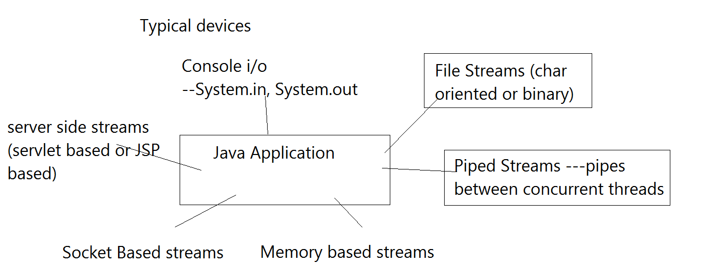

The classes we'll use are in the package `java.io`.

__Need for using Buffer:__

- When reading/writing a large data file, we need to use a buffer, because the entire file cannot be read into/written to the memory in one go.
- The reading of files from a buffer is a lot faster compared to reading it from a device, because each device has a different interface and may have read or write speed mismatch issues.

__Conversion Stream:__ When communicating with different devices we need to send binary data, as those devices work on binary data, which is hard to work with for us. For that there are some conversion streams which will do this conversion from/to binary data.

### Java I/O Overview

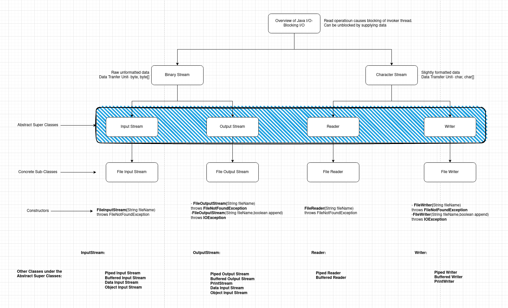

__NOTE:__ Any time, for the read operations the I/O APIs are blocking I/O, which means they will not proceed unless we supply the input, may that be from the console or files or socket programming.

### Types of Streams:

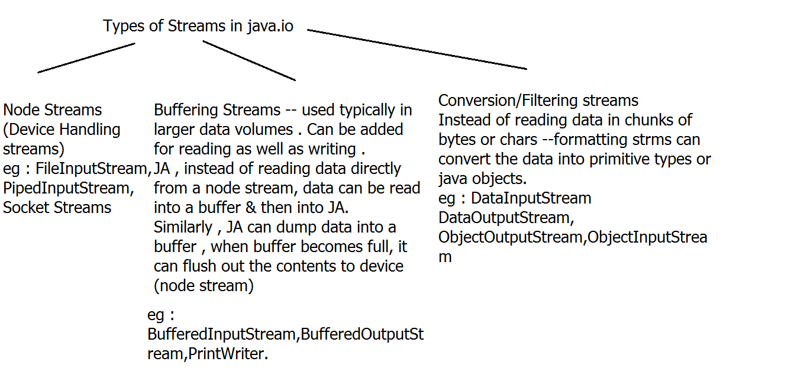

#### File Streams

__Description of FileInputStream:__ _java.io.FileInputStream_  
    Binary i/p stream connected to file device(bin/char) -> to read data.

__Description of FileOutputStream:__ _java.io.FileOutputStream_  
    Binary o/p stream connected to file device(bin/char) -> to write data.

__Description of FileReader:__ _java.io.FileReader_  
    Character i/p stream connected to file device(char) -> to read data.

__Description of FileWriter:__ _java.io.FileWriter_  
    Chatacter o/p stream connected to file device(char) -> to write data.

__NOTE:__ The above classes/streams are Node Streams, as they are handling or working with the nodes/data sources directly and we don't have to do anything ourselves. These are un-buffered streams.

__NOTE:__ Similar to that of FileInputStream, FileOutputStream, FileReader & FileWriter there are other Node Streams:

#### Piped Streams

This node stream is used to transfer data using streams between two threads using a pipe.

- Piped Input Stream

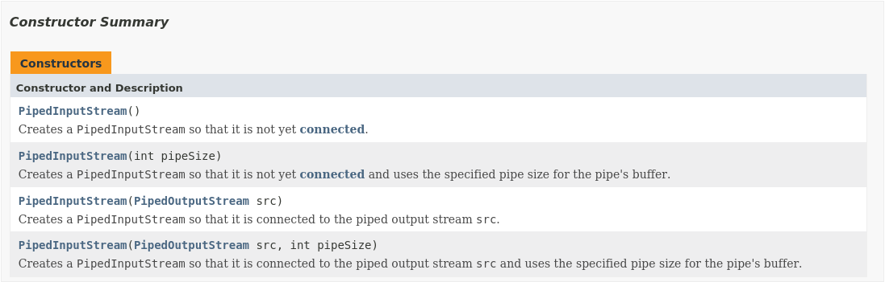

- Piped Output Stream

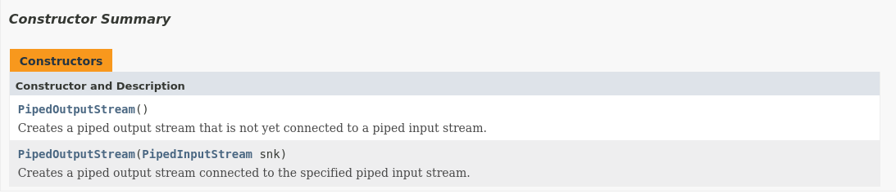

- Piped Reader

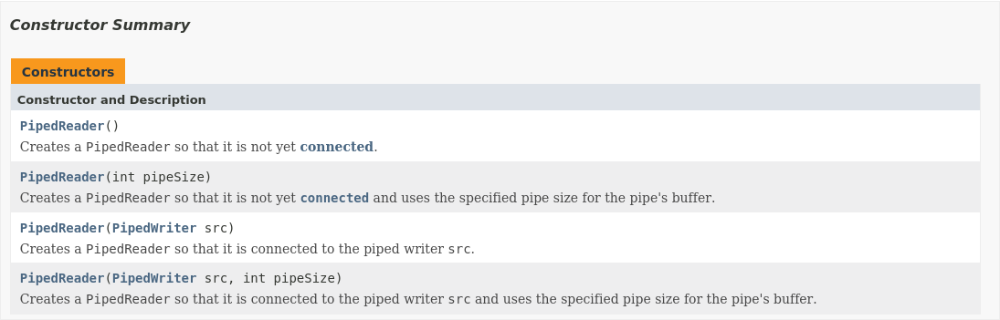

- Piped Writer

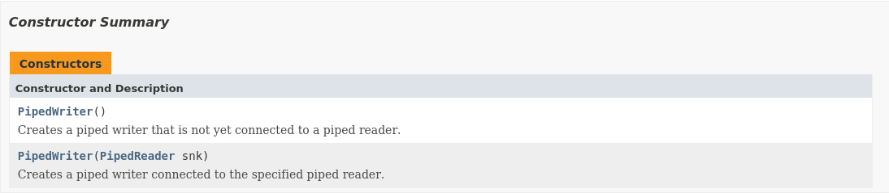

#### Buffered Streams

This stream is used to capture data from a node stream in a buffer. So, in constructors we have any node streams, for example file streams, piped streams, etc.

- Buffered Input Stream

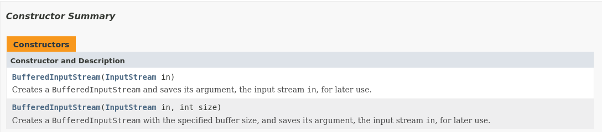

- Buffered Output Stream

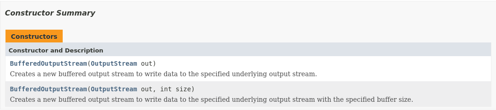

- Buffered Reader

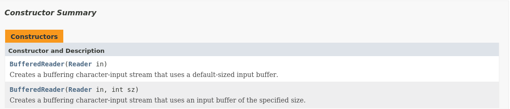

__NOTE:__ Important API of Buffered Reader: `public String readLine() throws IOException`. More info about that:

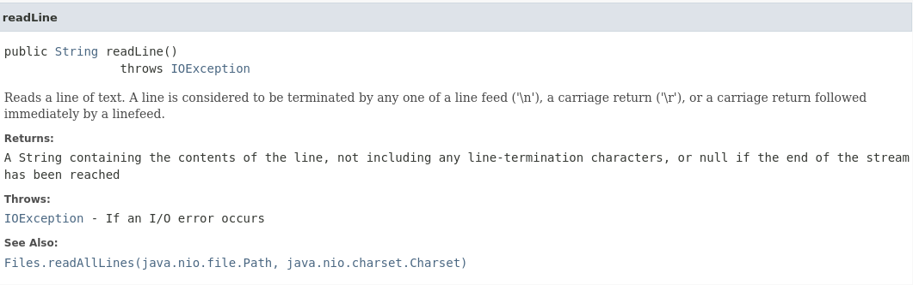

Here it returns null at the end of the stream, be it pipe stream, file stream or any other stream connected to the buffer stream.

- Buffered Writer

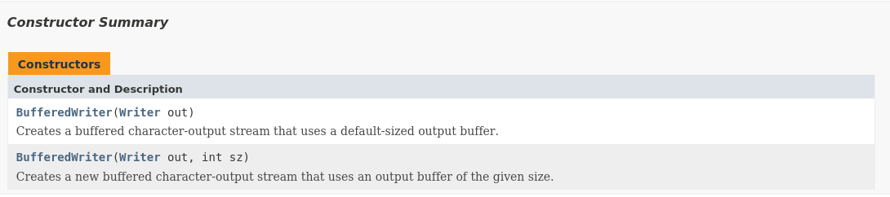

#### Data Streams

- Data Input Stream
- Data Output Stream
- Data Reader
- Data Writer

### Attaching Streams to Java Application

The basics of how streams are attached to a Java application is as belows:

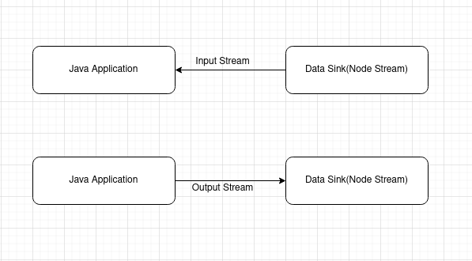

### Chaining of Streams

The way to read data from a text file into a Java Application is to use something called Chaining of Streams. Chaining of Streams means we're attaching the output of one stream to the input of another stream as it's input, sort of like a chain. The way to do that is:

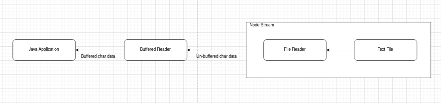

We're using FileReader and not FileStream is because we're working with character data and Reader and Writer are better to work with char data. To implement this in your program, the code to that is:

```java
package test;

import java.util.Scanner;
import java.io.BufferedReader;
import java.io.FileReader;
import java.io.FileNotFoundException;

class TestFileStreams {

    public static void main(String[] args) throws IOException {

        Scanner sc = new Scanner(System.in);
        try {
            System.out.print("Enter the file name you want to read the data from:");
            String fileName = sc.nextLine();
            BufferedReader br = new BufferedReader(new FileReader(fileName));
            String str = null;

            System.out.println("The contents of the file are:");
            while((str = br.readLine()) != null) {

                /*We're printing the contents of the line read which are found not-null. 
                It's because, readLine() return null at the end of file, i.e.,
                it doesn't have more data to read from the file.*/
                System.out.println(str);
            }

            System.out.println("End of file reached.");
        } catch(FileNotFoundException e) {
            System.out.println("The file given in the path not found.\nPlease check the path again & provide the correct one.");
        } catch(Exception e) {
            e.printStackTrace();
        }finally {
            // Closign the non-java resources: Streams is one of the non-java resources
            if (sc != null) {
                sc.close();
            }
            
            if (br != null) {
                br.close();
            }
        }
    }
}
```

In the above case, we have to use `throws IOException` section at the end of the main method signature or else it'll give a compiler error because the `close()` method can throw an IOException, and since it is a checked exception and has to handled, or passed over to the calling method, we're passing it over to the caller of the main method.

## Try with Resources & Autoclosable Interface

Since Java 1.7, we don't have to close the streams and file handlers manually ourselves as JVM can do this for us. To do this, we use a mechanism called Try with resources. And it's closely associated with an interface called `java.lang.AutoClosable` interface.

### AutoClosable Interface

An object that may hold resources (such as file or socket handles) until it is closed. The close() method of an AutoCloseable object is called automatically when exiting a try-with-resources block for which the object has been declared in the resource specification header. This construction ensures prompt release, avoiding resource exhaustion exceptions and errors that may otherwise occur.

__Method in AutoClosable interface:__

`void close()throws Exception`: Closes this resource, relinquishing any underlying resources. This method is invoked automatically on objects managed by the try-with-resources statement.

The entire streams defination can also be defined in try with resources section as they implement the `java.lang.AutoClosable` interface. The Autoclosable interface allows the try with resources block to close all the resources given in the resources section,and if it throws an Exception, it'll be part of the try block, and thus will be handled as such. Try with resources:

```java
class TestFileStreams {

    public static void main(String[] args) {

        System.out.print("Enter the file name you want to read the data from:");
        try(Scanner sc = new Scanner(System.in);
            BufferedReader br = new BufferedReader(new FileReader(sc.nextLine()))) {
            String str = null;

            System.out.println("The contents of the file are:");
            while((str = br.readLine()) != null) {
                System.out.println(str);
            }

            System.out.println("End of file reached.");
        } catch(FileNotFoundException e) {
            System.out.println("The file given in the path not found.\nPlease check the path again & provide the correct one.");
        } catch(Exception e) {
            e.printStackTrace();
        }
    }
}
```
