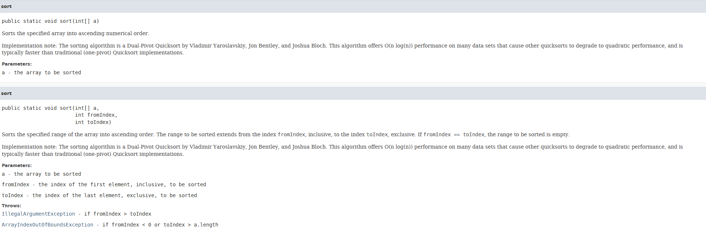
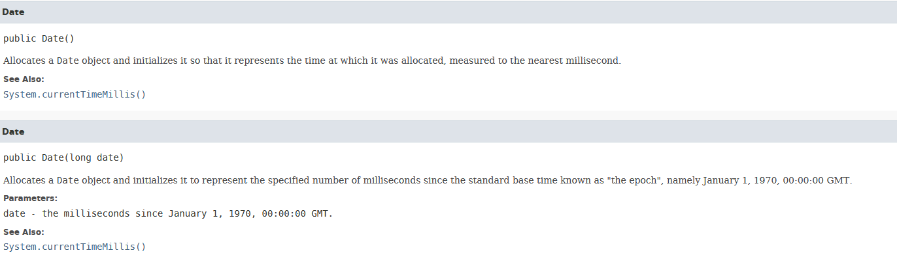
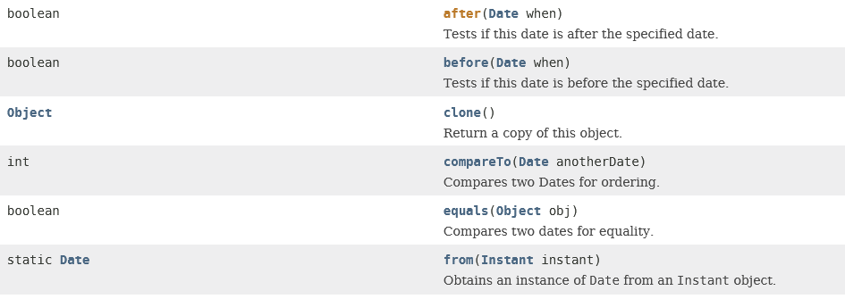
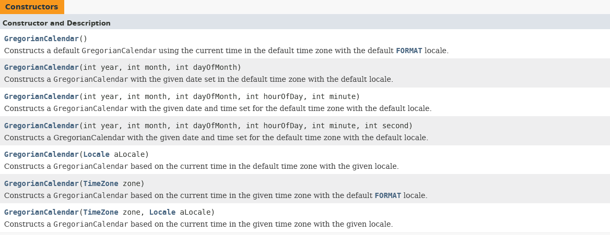
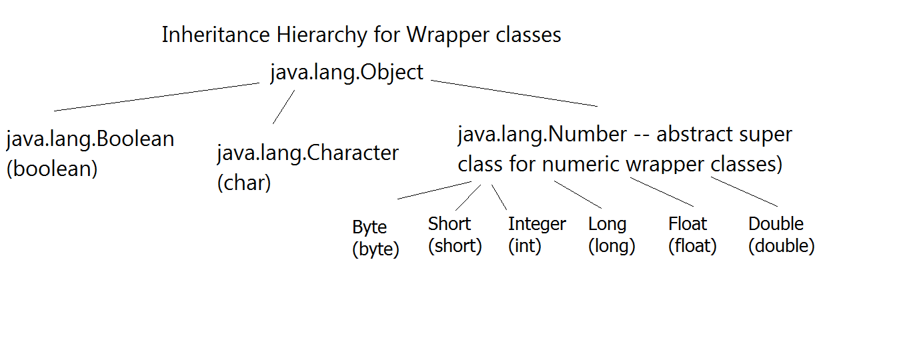
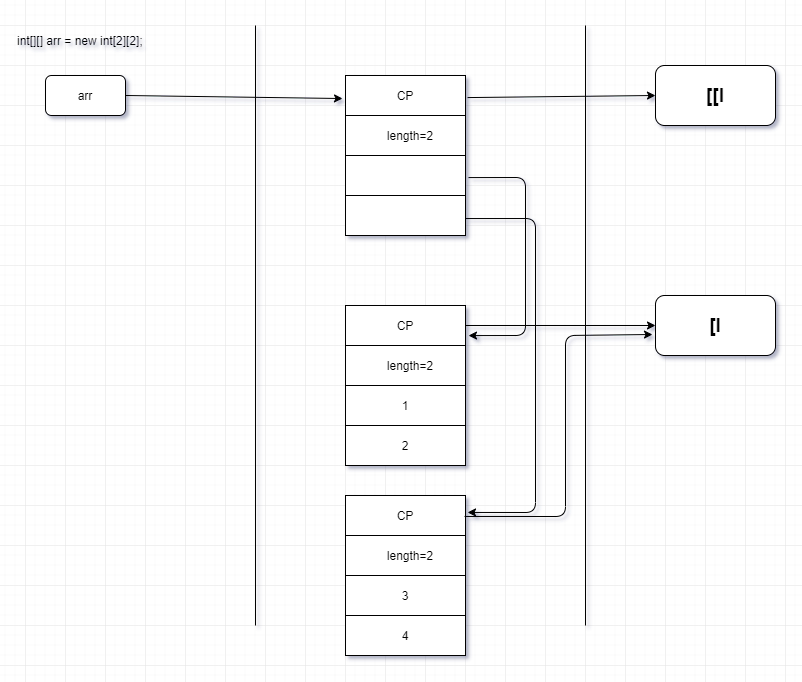
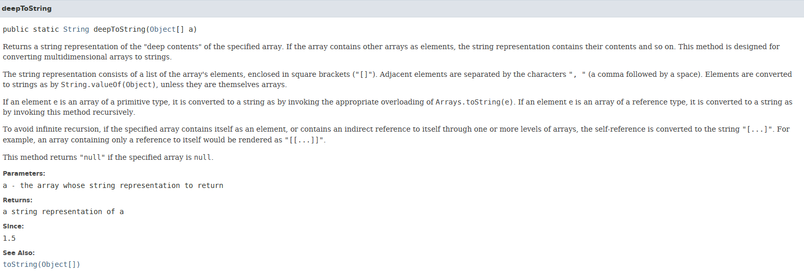

# Contents:
* [Comparable Interface](#comparable_interface)
* [Date-Time handling in Java](#date_time_handling)
* [Wrapper Classes](#wrapper_classes)
* [VarArgs in Java](#varargs)
* [Nested Classes in Java](#nested_classes)
* [Multi-Dimensional Arrays](#multi-dimensional_arrays)

# Comparable Interface:
<a name='comparable_interface'></a>

String class has already implemented `java.lang.Comparable` interface and thus has overridden the compareTo method to support the natural ordering. We'll be overridding this in a lot of collection classes when comparing the different objects based on their natural ordering.  
`java.lang.Comparable<T>`. Here `<T>` will be replaced by your class you're using. This interface has an method defined that we need to override. The name of the method is `int compareTo(T o)`. String class has already implemented it, and thus the implementation of this will go something like this:  
- Compares this object with the specified object for order. Returns a negative integer, zero, or a positive integer as this object is less than, equal to, or greater than the specified object.  
- x.compareTo(y) must throw an exception iff y.compareTo(x) throws an exception.  
- The implementor must also ensure that the relation is transitive: (x.compareTo(y)>0 && y.compareTo(z)>0) implies x.compareTo(z)>0.  

## Important API of the java.util.Arrays class for sorting:
`java.util.Arrays` is a utility class that we can use to perform operations on Arrays, for which we don't have to write a lot of algorithms on our own. One of such APIs is sort() method. It has different overloaded versions, and they are:
  
This sorts the array in natural ordering which is defined by the Java language for the integer type. To implement the natural ordering for custom-defined classes, we have to override the compareTo method in our own class and it's execution will be done using:
  

# Date-Time handling in Java: 
<a name='date_time_handling'></a>

There are three main classes in Java(till Java 7) that we use for Date-Time Handling:  
- Date class(`java.util.Date`)  
- Gregorian Calendar(`java.util.Calender` & it's sub-type- `java.util.GregorianCalender`)  
- SimpleDateFormat class(`java.text.SimpleDateFormat`)  which is a parser type of a class.  

The classes that we started using since Java 8 are:  
- LocalDate(`java.time.LocalDate`)
- LocalTime(`java.time.LocalTime`)  

## Methods in Date class for date-time handing in Java:
- Constructor:  
  
The other constructors are deprecated, so these are only ones which are used.  

- Some of the other methods of the Date class we can use are:  
  


## Methods in GregorianCalendar for date-time handling in Java:
We don't have much use of this class and it's APIs as we have better alternatives in Java8 which replaces this- LocalDate & LocalTime classes. But if needed, this is listed here.
The hierarchy of this class is:
`java.lang.Object` -> `java.util.Calendar` -> `java.util.GregorianCalendar`  
The class `java.util.Calendar` is an abstract super class and is extended by GregorianCalendar.  

The GregorianCalendar class has implementations from the little date-time handling starting from milliseconds to Era like AD/BC. Important API:  

- Constructors:  
  
__NOTE:__ For using the month, it starts with 0, i.e., 0 for January, 1 for Feb, and so on.  

- Conversion from GregorianCalendar to Date(`java.util.Date`):  


- Actions performed on GregorianCalendar instance:
```java
GregorianCalendar date = new GregorianCalendar(2000, 11, 31);

// Changing from GregorianCalender to Date
Date d=date.getTime();

// Changing the value of a field by updating the Calendar class constants
date.set(MONTH,10);
```

## Using SimpleDateFormat for date-time handling in Java:
For any action that requires us to take date, SimpleDateFormat should be the class that should be used as this provides/gives us a more readable format rather than milliseconds that we get from other class types in Date-Time handling.  
Using SimpleDateFormat:
```java
Scanner sc = new Scanner(System.in);

// Setting the format of the date how to use that.
SimpleDateFormat sdf = new SimpleDateFormat("dd/MM/yyyy");
try {
    System.out.println("Enter DOB -- day/mon/yr");
    // Parsing the date from String to Date instance.
    Date d=sdf.parse(sc.next());

    // Printing the date accoring to the Date class's toString method.
    System.out.println(d);

    // Printing the date according to the format specified above in SDF
    System.out.println("formatted date " + sdf.format(d));
} catch (Exception e) {
    e.printStackTrace();
} finally {
    if (sc != null)
        sc.close();
}
```
Adding Date-time handling in the assignment of day6:
- Core class: [Customer.java](./Classwork/src/com/app/core/Customer.java)  
- Custom Exception Handling class: [CustomerHandlingException.java](./Classwork/src/cust_excs/CustomerHandlingException.java)  
- Utility class: [ValidationRules.java](./Classwork/src/util/ValidationRules.java)  
- Tester class: [Test.java](./Classwork/src/tester/Test.java)  

For validation of date , we can use Date Class API, and taking help of Gregorian Calender for setting up the date that we need:
```java
public static Date validateDate(String date)throws ParseException, CustomerHandlingException {
    Date d= sdf.parse(date);

    // Birth day verification date.
    Date d1 = sdf.parse("01/01/2000");
    if(d.after(d1))
        throw new CustomerHandlingException("The user is not old enough");
    return d;
}
```

# Wrapper Classes
<a name='wrapper_classes'></a>

Class equivalent/representation of the primitive type of data are called Wrapper classes. Java Wrapper classes provide a way to use primitive data types ( int , boolean , etc..) as objects.

## What's need of wrapper classes?
- To be able to add primitive types to growable collection(growable data structure eg -- LinkedList)
- Wrapper classes contain useful api(eg --- parseInt, parseFloat...., isDigit,isWhiteSpace...).

## Inheritance Hierarchy of Wrapper Classes:

  
`java.lang.Object` is not part of this hierarchy, but it has been addded as it is the super class of all the classes in Java.  

## What and how:

__Boxing:__ Conversion of primitive types to it's wrapper equivalent.  
    _Example:_ int to Integer, char to Character.  
    _How is it done:_ using constructors.  
    _Example:_ `Integer i = new Integer(1234);`  
    Here 1234 is an int value that is encapsulated in the Wrapper class object. Typically boxing type of conversion is done via wrapper class constructors.  

__Unboxing:__ Conversion of wrapper types to it's primitive equivalent.  
    _Example:_ Integer to int, Character to char.  
    _How is it done:_ using Wrapper class APIs.  
    _Example:_ `int num = i.intValue();`  

__Autoboxing:__ Since JDK 1.5, the above two operations are not needed to be done explicitly and can be taken care of by the Java Compiler.  
    _Example:_ Automatic conversion from Primitive to Wrapper done by javac.  

__Auto un-boxing:__ Since JDK 1.5, the above two operations are not needed to be done explicitly and can be taken care of by the Java Compiler.  
    _Example:_ Automatic conversion from Wrapper to Primitive done by javac.  

_How it is done(Auto-boxing & Auto-unboxing):_ Let's see how the auto-boxing and auto-unboxing works.  
```java
Integer i1=100;             //Implicit statement: Integer i1 = new Integer(100);
int data=i1;                //Implicit statement: data=i1.intValue();

i1++;
/* 
Operations performed in steps:
1. Auto-unboxed from Integer to int type
2. Value incremented
3. Updated the value using Auto-boxing form int to Integer type
*/

System.out.println(i1);     //Overridden toString() method which returns i1.intValue();

Integer i2=i1++;            //Operations performed: Assignment of reference, Auto-unboxing of i1, Value Incremented of i1, Auto-boxing of i1
Integer i3=++i1;            //Operations performed: Auto-unboxing of i1, Value Incremented of i1, Auto-boxing of i1, Assignment of reference
System.out.println(i2 +" "+i3);

/* -----------Where Auto-boxing doesn't work----------- */
Double d=123;               //COMPILER ERROR Auto-boxing int --->Integer which cannot be converted into Double
Double d2=123.45F;          //COMPILER ERROR Auto-boxing float--->Float  which cannot be converted into Double

double d = 123;             // Operations performed: int--->widening--->double
Double d1 = (double) 123;   // Operations performed: int--->widening--->double--->Auto-boxing--->Double

Number n=1231.45;           //Operations Performed: double--->Double--->upcasting--->Number
Object o=12345;             //Operations Performed: int -->Integer---?upcasting--->NUmber--->upcasting--->Object

System.out.println(o.getClass().getName()); // O/P: java.lang.Integer

o=false;                    //Impllicit Statement:  o=new Boolean(false); 
							// Operations Performed: boolean -->Boolean--->upcasting--->Object. Thus completely acceptible.

System.out.println(o.getClass().getName()); // O/P: java.lang.Boolean
```

__NOTE:__    
- Wrapper classes have all the methods that we might need- toString(), compareTo(), equals(), etc.  
- Arithmetic operations cannot be done on normal references to the objects, but Wrapper classes are special. They can auto-box and auto-unbox which means all the operations are done on the values which the objects are holding. Example: In the above piece of code, `Integer i2 = i1++;`

__NOTE:__ There is also a concept of literal pools for Numeric Wrappers in Java. But the value of the objects in the Literal pool can have a range of only 1 byte. So if we have the data stored in Integer value as well which is in the range of a byte(-128 to 127), it'll add that to the Literal pool. Example:  
```java
Integer b1 = 127;           //Added to literal pool
Integer b2 = 127;           //Alrdy present in literal pool , so not created again and used b2 is pointing to the above object.
System.out.println(b1 == b2);   // O/P: returns true since this checks the reference equality of the two objects and the references are pointing to the same object.

Integer i1 = 128;           //new Integer(128)--not added literal pool 
Integer i2 = 128;           //new Integer(128) --not added literal pool 

System.out.println(i1 == i2);   // O/P: returns false since this checks the reference equality of the two objects and the references are pointing to different objects.
```

Another example:
```java
Integer i1=126;
Integer i2=126;
System.out.println(i1==i2); // O/P: true

i1++;       // Value: 127
i2++;       // Value: 127
System.out.println(i1==i2); // O/P: true

i1++;       // Value: 128
i2++;       // Value: 128
System.out.println(i1==i2); // O/P: false. At this point i1 and i2 are poiting to two different objects. A new object was created.
```

__NOTE:__ From the above concept, it is clear that, not everything is an object in java. But everything can be accessed using an object type of a reference.

# VarArgs in Java:
<a name='varargs'></a>

In java, varargs or Variable arguments are denoted by giving ellipses(`...`). A method that takes a variable number of arguments is a varargs method.  Syntax:
```java
public void fun (int ... a) {
   // method body
} 
```
__NOTE:__  
- This can be for both primitive type of data or reference type of data.  
- The varargs can only be supplied as the last parameter in the parameter list in the function defination.  
- VarArgs and Arrays are interchangable.  
- This syntax tells the compiler that fun( ) can be called with zero or more arguments. As a result, here a is implicitly declared as an array of type int[].  
- We can also pass an array to the varargs method and it'll work the same as passing an array to the method.  
- For reference type of variables, we can either pass the type of reference specified in the defination of the function, or any sub-type of the reference will also work.  

Using VarArgs:
```java
public void fun(int ...a) {
    System.out.println("Number of arguments: " + a.length);
    
    // using for each loop to display contents of a
    for (int i: a)
        System.out.print(i + " ");
    System.out.println();
}
```

# Nested Classes in Java
<a name='nested_classes'></a>

In Java, it is possible to define a class within another class, such classes are known as nested classes. They enable you to logically group classes that are only used in one place, thus this increases the use of encapsulation, and creates more readable and maintainable code.  
```java
class OuterClass {
...
    class NestedClass {
        ...
    }
}
```
- The scope of a nested class is bounded by the scope of its enclosing class. Thus in above example, class NestedClass does not exist independently of class OuterClass.  
- A nested class has access to the members, including private members, of the class in which it is nested. However, the reverse is not true i.e., the enclosing class does not have access to the members of the nested class.  
- A nested class is also a member of its enclosing class.  
- As a member of its enclosing class, a nested class can be declared private, public, protected, or package private(default).
- Nested classes are divided into two categories:
    1. _static nested class_ : Nested classes that are declared static are called static nested classes.
    2. _inner class_ : An inner class is a non-static nested class.  

## Types of Nested Classes:  


## 1. Static Nested Class:
In the case of normal or regular inner classes, without an outer class object existing, there cannot be an inner class object. i.e., an object of the inner class is always strongly associated with an outer class object. But in the case of static nested class, Without an outer class object existing, there may be a static nested class object. i.e., an object of a static nested class is not strongly associated with the outer class object.  
As with class methods and variables, a static nested class is associated with its outer class. And like static class methods, a static nested class cannot refer directly to instance variables or methods defined in its enclosing class: it can use them only through an object reference. They are accessed using the enclosing class name like `OuterClass.StaticNestedClass`.  
For example, to create an object for the static nested class, use this syntax:
```java
OuterClass.StaticNestedClass nestedObject = new OuterClass.StaticNestedClass();
```
Full code showing the use of static nested class:

```java
/* Java program to demonstrate accessing a static nested class */

// outer class
class OuterClass {
	// static member
	static int outer_x = 10;
	
	// instance(non-static) member
	int outer_y = 20;
	
	// private member
	private static int outer_private = 30;
	
	// static nested class
	static class StaticNestedClass {
		void display() {
			// can access static member of outer class
			System.out.println("outer_x = " + outer_x);
			
			// can access display private static member of outer class
			System.out.println("outer_private = " + outer_private);
			
			// The following statement will give compilation error as static nested class cannot directly access non-static members
			// System.out.println("outer_y = " + outer_y);
		
		}
	}
}

// Driver class
public class StaticNestedClassDemo {
	public static void main(String[] args) {
		// accessing a static nested class
		OuterClass.StaticNestedClass nestedObject = new OuterClass.StaticNestedClass();
		
		nestedObject.display();
		
	}
}

```
Output:
```
outer_x = 10
outer_private = 30
```

## 2. Inner classes:
Nested Inner class can access any private instance variable of outer class. Like any other instance variable, we can have access modifier private, protected, public and default modifier.
Like class, interface can also be nested and can have access specifiers.

Following example demonstrates a nested class:
```java
class Outer {
    // Simple nested inner class
    class Inner {
        public void show() {
            System.out.println("In a nested class method");
        }
    }
}
class Main {
    public static void main(String[] args) {
        Outer.Inner in = new Outer().new Inner();
        in.show();
    }
}
```
So, the syntax of the inner class is: 
```java
class OuterClass {
...
    class NestedClass {
        ...
    }
}
```
To instantiate an inner class, you must first instantiate the outer class. Then, create the inner object within the outer object with this syntax:  
```java
OuterClass outerObject = new OuterClass();
OuterClass.InnerClass innerObject = outerObject.new InnerClass();
```

## Comparison between normal or regular inner/nested class and static nested class:
Normal/Regular inner class | Static nested class
--- | ---
Without an outer class object existing, there cannot be an inner class object. That is, the inner class object is always associated with the outer class object. | Without an outer class object existing, there may be a static nested class object. That is, static nested class object is not associated with the outer class object.
Inside normal/regular inner class, static members can’t be declared. | Inside static nested class, static members can be declared.
As main() method can’t be declared, regular inner class can’t be invoked directly from the command prompt. | As main() method can be declared, the static nested class can be invoked directly from the command prompt.
Both static and non static members of outer class can be accessed directly. | Only a static member of outer class can be accessed directly.

There are two special kind of inner classes in Java:
- Local Inner Class  
- Anonymous Inner Class  

### Local Inner Class:
- Local Inner Classes are the inner classes that are defined inside a block.  
- Generally, this block is a method body. Sometimes this block can be a for loop, or an if clause.  
- Local Inner classes are not a member of any enclosing classes. They belong to the block they are defined within, due to which local inner classes cannot have any access modifiers associated with them.  
- However, they can be marked as final or abstract.  
- These class have access to the fields of the class enclosing it.  
- Local inner class must be instantiated in the block they are defined in.

__Rules of Local Inner Class:__  
1. The scope of local inner class is restricted to the block they are defined in.  
2. Local inner class __cannot__ be instantiated from outside the block where it is created in.  
3. Till JDK 7,Local inner class can access only final local variable of the enclosing block. However From JDK 8, it is possible to access the non-final local variable of enclosing block in local inner class.  
4. A local class has access to the members of its __enclosing class__.  
5. Local inner classes can extend an abstract class or can also implement an interface.  

__Declaring a Local Inner class:__  
A local inner class can be declared within a block. This block can be either a method body, initialization block, for loop or even an if statement.  

__Accessing Members:__  
- A local inner class has access to fields of the class enclosing it as well as the fields of the block that it is defined within.  
- These classes, however, can access the variables or parameters of the block that encloses it only if they are declared as final or are effectively final.  
- A variable whose value is not changed once initialized is called as effectively final variable.  
- A local inner class defined inside a method body, have access to it’s parameters.

__What happens at compile time?__  
When a program containing a local inner class is compiled, the compiler generate two .class files, one for the outer class and the other for the inner class that has the reference to the outer class. The two files are named by compiler as:  
- Outer.class  
- Outer$Inner.class  

__Declaration within a method body:__  
```java
// Java program to illustrate working of local inner classes
public class Outer
{
	private void getValue()
	{
		// Note that local variable(sum) must be final till JDK 7
		// hence this code will work only in JDK 8
		int sum = 20;
		
		// Local inner Class inside method
		class Inner
		{
			public int divisor;
			public int remainder;
			
			public Inner()
			{
				divisor = 4;
				remainder = sum%divisor;
			}
			private int getDivisor()
			{
				return divisor;
			}
			private int getRemainder()
			{
				return sum%divisor;
			}
			private int getQuotient()
			{
				System.out.println("Inside inner class");
				return sum / divisor;
			}
		}
		
		Inner inner = new Inner();
		System.out.println("Divisor = "+ inner.getDivisor());
		System.out.println("Remainder = " + inner.getRemainder());
		System.out.println("Quotient = " + inner.getQuotient());
	}
	
	public static void main(String[] args)
	{
		Outer outer = new Outer();
		outer.getValue();
	}
}
```
Output:
```
Divisor = 4
Remainder = 0
Inside inner class
Quotient = 5
```

__NOTE:__ A local class can access local variables and parameters of the enclosing block that are effectively final. For example, if you add the highlighted assignment statement in the Inner class constructor or in any method of Inner class in above example :
```java
public Inner()
{
       sum = 50;
       divisor = 4;
       remainder = sum%divisor;
}
```
Because of this assignment statement, the variable sum is not effectively final anymore. As a result, the Java compiler generates an error message similar to “local variables referenced from an inner class must be final or effectively final”.

__Declaration inside an if statement:__
```java
// Java program to illustrate Declaration of local inner classes inside an if statement
public class Outer
{
	public int data = 10;
	public int getData()
	{
		return data;
	}
	public static void main(String[] args)
	{
		Outer outer = new Outer();
		
		if(outer.getData() < 20)
		{
			// Local inner class inside if clause
			class Inner
			{
				public int getValue()
				{
					System.out.println("Inside Inner class");
					return outer.data;
				}
			}

			Inner inner = new Inner();
			System.out.println(inner.getValue());
		}
		else
		{
			System.out.println("Inside Outer class");
		}
	}
}

```
Output:
```
Inside Inner class
10
```

__Demonstrating Erroneous codes(Compile Error) for Inner class:__
```java
// Java code to demonstrate that inner classes cannot be declared as static
public class Outer
{
	private int getValue(int data)
	{
		static class Inner
		{
			private int getData()
			{
				System.out.println("Inside inner class");
				if(data < 10)
				{
					return 5;
				}
				else
				{
					return 15;
				}
			}
		}
		
		Inner inner = new Inner();
		return inner.getData();
	}
	
	public static void main(String[] args)
	{
		Outer outer = new Outer();
		System.out.println(outer.getValue(10));
	}
}

```
__Explanation:__  The above program causes compilation error because the inner class cannot be declared
as static. Inner classes are associated with the block they are defined within and not with the external class(Outer in this case).

```java
// Java code to demonstrate the scope of inner class
public class Outer
{
	private void myMethod()
	{
		class Inner
		{
			private void innerMethod()
			{
				System.out.println("Inside inner class");
			}
		}
	}
	
	public static void main(String[] args)
	{
		Outer outer = new Outer();
		Inner inner = new Inner();
		System.out.println(inner.innerMethod());
	}
}

```
__Explanation:__ The above program causes compilation error because the scope of inner classes are restricted to the block they are defined in.

### Anonymous Inner Class in Java:
- It is an inner class without a name and for which only a single object is created. An anonymous inner class can be useful when making an instance of an object with certain “extras” such as overloading methods of a class or interface, without having to actually subclass a class.  
- Anonymous inner classes are useful in writing implementation classes for listener interfaces in graphics programming.  
- Anonymous inner class are mainly created in two ways:
    1. Class (may be abstract or concrete)
    2. Interface

__Syntax:__ The syntax of an anonymous class expression is like the invocation of a constructor, except that there is a class definition contained in a block of code.
```java
// Test can be interface,abstract/concrete class
Test t = new Test() {
   // data members and methods
   public void test_method() {
      ........
      ........
    }   
};
```
To understand anonymous inner class, let us take a simple program.  
```java
//Java program to demonstrate need for Anonymous Inner class
interface Age {
	int x = 21;
	void getAge();
}
class AnonymouDemo {
	public static void main(String[] args) {
		// Myclass is implementation class of Age interface
		MyClass obj=new MyClass();

		// calling getage() method implemented at Myclass
		obj.getAge();	
	}
}

// Myclass implement the methods of Age Interface
class MyClass implements Age {
	@Override
	public void getAge() {
		// printing the age
		System.out.print("Age is "+x);
	}
}
```
In the program, interface Age is created with getAge() method and x=21.  Myclass is written as implementation class of Age interface. As done in Program, there is no need to write a  separate class Myclass. Instead,   directly copy the code of Myclass into this parameter, as shown here:
```java
Age oj1 = new Age() {
            @Override
            public void getAge() {
                System.out.print("Age is "+x);
            }
        };
```
Here, an object to Age is not created but an object of Myclass is created and copied in the entire class code as shown above. This is possible only with anonymous inner class. Such a class is called ‘anonymous inner class’, so here we call ‘Myclass’ as anonymous inner class.

__Anonymous inner class version of the above Program:__ 
```java
//Java program to demonstrate Anonymous inner class
interface Age
{
	int x = 21;
	void getAge();
}
class AnonymousDemo
{
	public static void main(String[] args) {

		// Myclass is hidden inner class of Age interface
		// whose name is not written but an object to it
		// is created.
		Age oj1 = new Age() {
			@Override
			public void getAge() {
				// printing age
				System.out.print("Age is "+x);
			}
		};
		oj1.getAge();
	}
}
```
__NOTE:__ The name of the anonymous inner class is given by the compiler and the value of that is: `<Fully Qualified class name>.Outerclass$1`.  
__Types of anonymous inner class:__ Based on declaration and behavior, there are 3 types of anonymous Inner classes:

1. __Anonymous Inner class that extends a class:__ We can have an anonymous inner class that extends a class.For example, we know that we can create a thread by extending a Thread class. Suppose we need an immediate thread but we don’t want to create a class that extend Thread class all the time. By the help of this type of Anonymous Inner class we can define a ready thread as follows:
```java
//Java program to illustrate creating an immediate thread
//Using Anonymous Inner class that extends a Class
class MyThread {

	public static void main(String[] args) {

		//Here we are using Anonymous Inner class
		//that extends a class i.e. Here a Thread class
		Thread t = new Thread()	{

			public void run() {
				System.out.println("Child Thread");
			}
		};
		t.start();
		System.out.println("Main Thread");
	}
}

```
Output:
```
Main Thread
Child Thread
OR
Child Thread
Main Thread
```

2. __Anonymous Inner class that implements an interface:__ We can also have an anonymous inner class that implements an interface. For example, we also know that by implementing Runnable interface we can create a Thread. Here we use anonymous Inner class that implements an interface.
```java
//Java program to illustrate defining a thread
//Using Anonymous Inner class that implements an interface
class MyThread {

	public static void main(String[] args) {

		//Here we are using Anonymous Inner class
		//that implements a interface i.e. Here Runnable interface
		Runnable r = new Runnable()	{

			public void run() {
				System.out.println("Child Thread");
			}
		};
		Thread t = new Thread(r);
		t.start();
		System.out.println("Main Thread");
	}
}
```
Output:
```
Main Thread
Child Thread
OR
Child Thread
Main Thread
```

3. __Anonymous Inner class that defines inside method/constructor argument:__ Anonymous inner classes in method/constructor arguments are often used in graphical user interface (GUI) applications. To get you familiar with syntax lets have a look on the following program that creates a thread using this type of Anonymous Inner class :
```java
//Java program to illustrate defining a thread
//Using Anonymous Inner class that define inside argument
class MyThread {

	public static void main(String[] args) {

		//Here we are using Anonymous Inner class
		//that define inside argument, here constructor argument
		Thread t = new Thread(new Runnable() {

			public void run() {

				System.out.println("Child Thread");
			}
		});
		
		t.start();
		System.out.println("Main Thread");
	}
}
```
Output:
```
Main Thread
Child Thread
OR
Child Thread
Main Thread
```

### Difference between Normal/Regular class and Anonymous Inner class:
- A normal class can implement any number of interfaces but anonymous inner class can implement only one interface at a time.  
- A regular class can extend a class and implement any number of interface simultaneously. But anonymous Inner class can extend a class or can implement an interface but not both at a time.  
- For regular/normal class, we can write any number of constructors but we cant write any constructor for anonymous Inner class because anonymous class does not have any name and while defining a constructor, class name and constructor name must be same.  

### Accessing Local Variables of the Enclosing Scope, and Declaring and Accessing Members of the Anonymous Class
Like local classes, anonymous classes can capture variables; they have the same access to local variables of the enclosing scope:

- An anonymous class has access to the members of its enclosing class.  
- An anonymous class cannot access local variables in its enclosing scope that are not declared as final or effectively final.  
- Like a nested class, a declaration of a type (such as a variable) in an anonymous class shadows any other declarations in the enclosing scope that have the same name.  

Anonymous classes also have the same restrictions as local classes with respect to their members:  
- We cannot declare static initializers or member interfaces in an anonymous class.  
- An anonymous class can have static members provided that they are constant variables.  

Note that you can declare the following in anonymous classes:

    Fields
    Extra methods (even if they do not implement any methods of the supertype)
    Instance initializers
    Local classes

However, constructors can not be declared in an anonymous class. 

# Multi-Dimensional Arrays:
<a name='multi-dimensional_arrays'></a>

Multi-dimensional arrays are nothing but array of references. So the memory picture of that is:  
  
So accessing and using the dimensional array will be similar to the array of references of array.  

__Declaration:__
```java
int[][] arr = new int[2][2];
```

__Initialization:__
```java
for (int i=0; i<arr.length; i++) {
    for (int j=0; j<arr[i].length; j++) {
        arr[i][j] = sc.nextInt();
    }
}
```

__Accessing:__ 
```java
for(int i: arr) {
    System.out.println(i);
}

// or 
for (int i=0; i<arr.length; i++) {
    for (int j=0; j<arr[i].length; j++) {
        System.out.println(arr[i][j]);
    }
}
```

__NOTE:__ A utility method to print the contents of a multi-dimensional array is: Arrays.deepToString(). The details of that is:  

