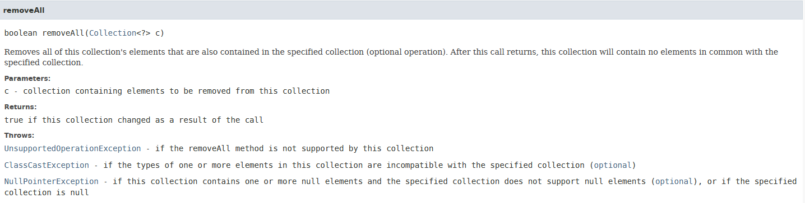
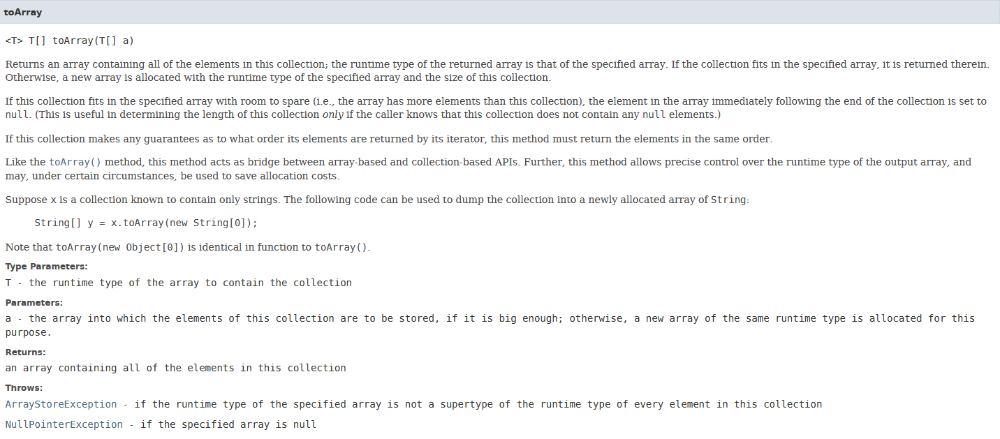

# Contents:
* [Enums in Java](#enums_in_java)
* [Generics in Java](#generics_in_java)
* [Collection Framework in Java](#collection_framework)

# Enums in Java:
<a name='enums_in_java'></a>

- Enumerations serve the purpose of representing a group of named constants in a programming language.  
- For example the 4 suits in a deck of playing cards may be 4 enumerators named Club, Diamond, Heart, and Spade, belonging to an enumerated type named Suit.  
- Other examples include natural enumerated types (like the planets, days of the week, colors, directions, etc.).  
- Enums are used when we know all possible values at compile time, such as choices on a menu, rounding modes, command line flags, etc.  
- It is not necessary that the set of constants in an enum type stay fixed for all time.  

- In Java (from 1.5), enums are represented using enum data type.  
- In Java, we can also add variables, methods and constructors to it.  
- The main objective of enum is to define our own data types(Enumerated Data Types)  

__Declaration of enum in java:__  
Enum declaration can be done outside a Class or inside a Class but not inside a Method.
```java
// A simple enum example where enum is declared outside any class (Note enum keyword instead of class keyword)
enum Color {
	RED, GREEN, BLUE;
}

public class Test {
	// Driver method
	public static void main(String[] args) {
		Color c1 = Color.RED;
		System.out.println(c1);
	}
}
```
Output:
```
RED
```

```java
// enum declaration inside a class.
public class Test {
	enum Color {
		RED, GREEN, BLUE;
	}

	// Driver method
	public static void main(String[] args) {
		Color c1 = Color.RED;
		System.out.println(c1);
	}
}
```
Output:
```
RED
```
- First line inside enum should be list of constants and then other things like methods, variables and constructor.  
- According to Java naming conventions, it is recommended that we name constant with all capital letters.  

__Important points of enum:__  
- Every enum internally implemented by using Class.  
```java
// internally above enum Color is converted to
class Color {
    public static final Color RED = new Color();
    public static final Color BLUE = new Color();
    public static final Color GREEN = new Color();
}
```
- Every enum constant represents an object of type enum.  
- enum type can be passed as an argument to switch statement.  
```java
// A Java program to demonstrate working on enum
// in switch case (Filename Test. Java)
import java.util.Scanner;

// An Enum class
enum Day {
	SUNDAY, MONDAY, TUESDAY, WEDNESDAY,
	THURSDAY, FRIDAY, SATURDAY;
}

// Driver class that contains an object of "day" and
// main().
public class Test {
	Day day;

	// Constructor
	public Test(Day day) {
		this.day = day;
	}

	// Prints a line about Day using switch
	public void dayIsLike()	{
		switch (day) {
		case MONDAY:
			System.out.println("Mondays are bad.");
			break;
		case FRIDAY:
			System.out.println("Fridays are better.");
			break;
		case SATURDAY:
		case SUNDAY:
			System.out.println("Weekends are best.");
			break;
		default:
			System.out.println("Midweek days are so-so.");
			break;
		}
	}

	// Driver method
	public static void main(String[] args) {
		String str = "MONDAY";
		Test t1 = new Test(Day.valueOf(str));
		t1.dayIsLike();
	}
}
```
Output
```
Mondays are bad.
```
- Every enum constant is always implicitly public static final. Since it is static, we can access it by using enum Name. Since it is final, we can’t create child enums.  
- We can declare main() method inside enum. Hence we can invoke enum directly from the Command Prompt.  
```java
// A Java program to demonstrate that we can have main() inside enum class.
enum Color {
	RED, GREEN, BLUE;

	// Driver method
	public static void main(String[] args) {
		Color c1 = Color.RED;
		System.out.println(c1);
	}
}
```
Output:
```
RED
```
## Enum and Inheritance:
- All enums implicitly extend `java.lang.Enum` class. As a class can only extend one parent in Java, so an enum cannot extend anything else.  
- toString() method is overridden in java.lang.Enum class,which returns enum constant name.  
- enum can implement many interfaces.  

## values(), ordinal() and valueOf() methods:
- These methods are present inside `java.lang.Enum`.  
- values() method can be used to return all constants present inside enum. It returns an array of enum type containing all the enum constants.  
- Order is important in enums. By using ordinal() method, each enum constant index can be found, just like array index.  
- valueOf() method returns the enum constant of the specified string value, if exists.  
```java
// Java program to demonstrate working of values(), ordinal() and valueOf()
enum Color {
	RED, GREEN, BLUE;
}

public class Test {
	public static void main(String[] args) {
		// Calling values()
		Color arr[] = Color.values();

		// enum with loop
		for (Color col : arr) {
			// Calling ordinal() to find index
			// of color.
			System.out.println(col + " at index "
							+ col.ordinal());
		}

		// Using valueOf(). Returns an object of
		// Color with given constant.
		// Uncommenting second line causes exception
		// IllegalArgumentException
		System.out.println(Color.valueOf("RED"));
		// System.out.println(Color.valueOf("WHITE"));
	}
}
```
Output:
```
RED at index 0
GREEN at index 1
BLUE at index 2
RED
```

## enum and constructor:
- enum can contain constructor and it is executed separately for each enum constant at the time of enum class loading.  
- We can’t create enum objects explicitly and hence we can’t invoke enum constructor directly.  

## enum and methods:
- enum can contain both concrete methods and abstract methods. If an enum class has an abstract method, then each instance of the enum class must implement it  
```java
// Java program to demonstrate that enums can have constructor
// and concrete methods.

// An enum (Note enum keyword inplace of class keyword)
enum Color {
	RED, GREEN, BLUE;

	// enum constructor called separately for each
	// constant
	private Color() {
		System.out.println("Constructor called for : " +
		this.toString());
	}

	public void colorInfo() {
		System.out.println("Universal Color");
	}
}

public class Test {	
	
	// Driver method
	public static void main(String[] args) {
		Color c1 = Color.RED;
		System.out.println(c1);
		c1.colorInfo();
	}
}
```
Output:
```
Constructor called for : RED
Constructor called for : GREEN
Constructor called for : BLUE
RED
Universal Color
```

## Enum with Customized Value in Java:
By default enums have their own string values, we can also assign some custom values to enums. Consider below example for that.  
Examples:
```java
enum  Fruits {
    APPLE(“RED”), BANANA(“YELLOW”), GRAPES(“GREEN”);
}
```
In above example we can see that the Fruits enum have three members i.e APPLE, BANANA and GRAPES with have their own different custom values RED, YELLOW and GREEN respectively.  
Now to use this enum in code, there are some points we have to follow:-  
1. We have to create parameterized constructor for this enum class. Why? Because as we know that enum class’s object can’t be create explicitly so for initializing we use parameterized constructor. And the constructor cannot be the public or protected it must have private or default modifiers. Why? if we create public or protected, it will allow initializing more than one objects. This is totally against enum concept.  
2. We have to create one getter method to get the value of enums.  
```java
// Java program to demonstrate how values can
// be assigned to enums.
enum TrafficSignal {
	// This will call enum constructor with one
	// String argument
	RED("STOP"), GREEN("GO"), ORANGE("SLOW DOWN");

	// declaring private variable for getting values
	private String action;

	// getter method
	public String getAction() {
		return this.action;
	}

	// enum constructor - cannot be public or protected
	private TrafficSignal(String action) {
		this.action = action;
	}
}

// Driver code
public class EnumConstructorExample {
	
	public static void main(String args[]) {
		// let's print name of each enum and there action
		// - Enum values() examples
		TrafficSignal[] signals = TrafficSignal.values();

		for (TrafficSignal signal : signals) {
			// use getter method to get the value
			System.out.println("name : " + signal.name() +
						" action: " + signal.getAction() );
		}
	}
}
```
Output:
```
name : RED action: STOP
name : GREEN action: GO 
name : ORANGE action: SLOW DOWN 
```

# Generics in Java:
<a name='generics_in_java'></a>

<details><summary>Class notes</summary>

- Available from Java SE 5 onwards.  
- Represents Parameterized Types.(eg : `ArrayList<Emp>`)  
- Can Create Generic classes, interfaces, methods and constructors.  

- In Pre-generics world , similar achieved via Object class reference.  
- __Syntax:__ Similar to c++ templates (angle brackets)  
	eg : `ArrayList<Emp>` , `HashMap<Integer,Account>` .....

1. Syntax is different than C++ --for nested collections only.  
2. NO code bloat issues unlike c++;  

## Advantages of using Generics:
Adds Type Safety to the code @ compile time.  
__Meaning:__  
1. Can add type safe code where type-mismatch errors(i.e ClassCastExceptions) are caught at compile time.  
2. No need of explicit type casting, as all casts are automatic and implicit.  

- A generic class means that the class declaration includes a type parameter. eg  `class MyGeneric<T>`.  
- T -> type which is of reference type  
- T -> only ref types are supported (no primitive types)

</details>

<hr>

Generics means parameterized types. The idea is to allow type (Integer, String, … etc, and user-defined types) to be a parameter to methods, classes, and interfaces. Using Generics, it is possible to create classes that work with different data types.  
An entity such as class, interface, or method that operates on a parameterized type is called generic entity.

## Why Generics?
__Object__ is the superclass of all other classes and Object reference can refer to any type object. These features lack type safety. Generics adds that type safety feature.  
Generics in Java is similar to templates in C++. For example, classes like HashSet, ArrayList, HashMap, etc use generics very well. There are some fundamental differences between the two approaches to generic types.

## Generic Class:
Like C++, we use <> to specify parameter types in generic class creation. To create objects of generic class, we use following syntax:
```java
// To create an instance of generic class 
BaseType <Type> obj = new BaseType <Type>()
```

__Note:__ In Parameter type we can not use primitives like `int`, `char` or `double`.


```java
// A Simple Java program to show working of user defined Generic classes

// We use < > to specify Parameter type
class Test<T> {
	
	// An reference of type T is declared
	T obj;

	// constructor
	Test(T obj) { 
		this.obj = obj; 
	}

	public T getObject() {
		return this.obj; 
	}
}

// Driver class to test above
class Main {

	public static void main (String[] args) {

		// instance of Integer type
		Test <Integer> iObj = new Test<Integer>(15);
		System.out.println(iObj.getObject());

		// instance of String type
		Test <String> sObj = new Test<String>("Generic Programming");
		System.out.println(sObj.getObject());
	}
}
```
Output:
```
15
Generic Programming
```

We can also pass multiple Type parameters in Generic classes.
```java
// A Simple Java program to show multiple type parameters in Java Generics

// We use < > to specify Parameter type
class Test<T, U> {

	T obj1; // An object of type T
	U obj2; // An object of type U

	// constructor
	Test(T obj1, U obj2) {

		this.obj1 = obj1;
		this.obj2 = obj2;
	}

	// To print objects of T and U
	public void print()	{

		System.out.println(obj1);
		System.out.println(obj2);
	}
}

// Driver class to test above
class Main {
	
	public static void main (String[] args) {

		Test <String, Integer> obj = new Test<String, Integer>("Generics Programming", 15);
		obj.print();
	}
}
```
Output:
```
Generics Programming
15
```

## Generic Methods:
We can also write generic methods that can be called with different types of arguments. Based on the type of arguments passed to generic method, the compiler handles each method.
```java
// A Simple Java program to show working of user defined Generic functions
class Test {

	// A Generic method example
	static <T> void genericDisplay (T element) {
		System.out.println(element.getClass().getName() + " = " + element);
	}

	// Driver method
	public static void main(String[] args) {

		// Calling generic method with Integer argument
		genericDisplay(11);

		// Calling generic method with String argument
		genericDisplay("Generics Programming");

		// Calling generic method with double argument
		genericDisplay(1.0);
	}
}
```
Output:
```
java.lang.Integer = 11
java.lang.String = Generics Programming
java.lang.Double = 1.0
```


__NOTE:__ Generics methods cannot work with generic type variable arguments. It shows this warning:
```bash
warning: [unchecked] Possible heap pollution from parameterized vararg type T
```  
To overcome this, we have to use an annotation- `@SafeVarargs`, which will help supress this warning.

## Generics work only with Reference Types:
When we declare an instance of generic type, the type argument passed to the type parameter must be a reference type. We cannot use primitive data types like int,char...  
`Test<int> obj = new Test<int>(20);`  
The above line results in a compile-time error, that can be resolved by using type wrappers to encapsulate a primitive type.

## Generics Types Differ Based on Their Type Arguments:
Consider the following Java code.
```java
// A Simple Java program to show working of user-defined Generic classes
// We use < > to specify Parameter type
class Test<T> {
	
	// An object of type T is declared
	T obj;

	// constructor
	Test(T obj) { 
		this.obj = obj; 
	} 
	public T getObject() { 
		return this.obj; 
	}
}

// Driver class to test above
class Main {

	public static void main (String[] args) {

		// Instance of Integer type
		Test <Integer> iObj = new Test<Integer>(15);
		System.out.println(iObj.getObject());

		// Instance of String type
		Test <String> sObj = new Test<String>("Generics Programming");
		System.out.println(sObj.getObject());
		iObj = sObj; //This results an error
	}
}
```
Output:
```
error:
 incompatible types:
 Test cannot be converted to Test 
```
Even though iObj and sObj are of type Test, they are the references to different types because their type parameters differ. Generics add type safety through this and prevent errors.

## Advantages of Generics:
Programs that uses Generics has got many benefits over non-generic code.  
1. __Code Reuse:__ We can write a method/class/interface once and use for any type we want.  
2. __Type Safety:__ Generics make errors to appear compile time than at run time (It’s always better to know problems in your code at compile time rather than making your code fail at run time). Suppose you want to create an ArrayList that store name of students and if by mistake programmer adds an integer object instead of string, compiler allows it. But, when we retrieve this data from ArrayList, it causes problems at runtime.
```java
// A Simple Java program to demonstrate that NOT using
// generics can cause run time exceptions
import java.util.*;

class Test {
	
	public static void main(String[] args) {
		
		// Creatinga an ArrayList without any type specified
		ArrayList al = new ArrayList();

		al.add("Sachin");
		al.add("Rahul");
		al.add(10); // Compiler allows this

		String s1 = (String)al.get(0);
		String s2 = (String)al.get(1);

		// Causes Runtime Exception
		String s3 = (String)al.get(2);
	}
}
```
Output:
```
Exception in thread "main" java.lang.ClassCastException: 
   java.lang.Integer cannot be cast to java.lang.String
    at Test.main(Test.java:19)
```

__How generics solve this problem?__  
At the time of defining ArrayList, we can specify that this list can take only String objects.
```java
// Using generics converts run time exceptions into
// compile time exception.
import java.util.*;

class Test
{
	public static void main(String[] args)
	{
		// Creating a an ArrayList with String specified
		ArrayList <String> al = new ArrayList<String> ();

		al.add("Sachin");
		al.add("Rahul");

		// Now Compiler doesn't allow this
		al.add(10);

		String s1 = (String)al.get(0);
		String s2 = (String)al.get(1);
		String s3 = (String)al.get(2);
	}
}
```
Output:
```
15: error: no suitable method found for add(int)
        al.add(10); 
          ^
```

3. __Individual Type Casting is not needed:__ If we do not use generics, then, in the above example every-time we retrieve data from ArrayList, we have to typecast it. Typecasting at every retrieval operation is a big headache. If we already know that our list only holds string data then we need not to typecast it every time.
```java
// We don't need to typecast individual members of ArrayList
import java.util.*;

class Test {

	public static void main(String[] args) {

		// Creating a an ArrayList with String specified
		ArrayList <String> al = new ArrayList<String> ();

		al.add("Sachin");
		al.add("Rahul");

		// Typecasting is not needed
		String s1 = al.get(0);
		String s2 = al.get(1);
	}
}
```
4. __Implementing generic algorithms:__ By using generics, we can implement algorithms that work on different types of objects and at the same time they are type safe too.  

# Collection Framework in Java:
<a name='collection_framework'></a>

Collection is a collection of references. Collection Framework -> Readymade implementation of standard algorithms. Collection framework is extensible. The collection framework API is in `java.util` package.  
  
The above diagram shows the hierarchy of the collection framework.  

__NOTE:__ The Iterable interface(`java.lang.Iterable<E>`) is not part of the collection interface, but it is extended by Collection interface to give the collections iterable functionality.  

The different components of the above diagram are:
## Iterable<E> I/F:
- This interface is part of the `java.lang` package.  
- This interface is not part of the collection framework.  
- This is extended by Collection interface to give the collections iterable functionality.  
- The Iterable interface has a method called `iterator()`, which returns an `Iterator<T>` type of reference.  
- This Iterator is nothing but cursor which will allow us to iterate over the elements of the collection.  
- This can be replaced by for-each loop, but this is a safer and more elegant approach than a for-each loop.  

## Collection<E> I/F:
- Collection interface doesn't have any concrete implementation of the methods that is listed in it.  
- The other interfaces/classes which extend/implement this will take care of the implementation on their own, as different classes will have different methods of implementing these operations on their own classes.  
- This is a super interface of `Set<E>`, `List<E>` and `Queue<E>`.  
- There is no concrete implementing class of Collection interface.  
- It is not required, but if really necessary, you can also extend/implement this and build your own collection.  
- Some of the methods of Collection interface are:
	1. `boolean add(E e)`: 
		- This will add the reference of the element given in the parameter list.  
		- It adds a single element at a time.  
		- It returns a boolean value- which is the status of the insertion operation.  
		- <details><summary>More details</summary>

			
			</details>
			
	2. `boolean addAll(Collection<? extends E> c)`:
		- This will add all the references of the collection given in the parameter list to the collection which invokes this method.  
		- This returns a boolean value- which is the status of the insertion operation.  
		- <details><summary>More details</summary>

			
			</details>

	3. `void clear()`:
		
		- This will remove all of the elements from this collection (optional operation).

	4. `boolean contains(Object o)`:
		- Returns true if this collection contains the specified element.  
		- More formally, returns true if and only if this collection contains at least one element e such that `(o==null ? e==null : o.equals(e)).`  
	    - <details><summary>More details</summary>

			
			</details>

	5. `boolean containsAll(Collection<?> c)`:
		
		- Returns true if this collection contains all of the elements in the specified collection.  

	6. `boolean equals(Object o)`:
		- Compares the specified object with this collection for equality.  
		- <details><summary>More details</summary>

			
			</details>

	7. `isEmpty()`:
		- Returns true if this collection contains no elements.

	8. `boolean remove(Object o)`:
		- Removes a single instance of the specified element from this collection, if it is present (optional operation).  
		- Returns true if an element was removed as a result of this call.  
		- <details><summary>More details</summary>

			
			</details>

	9. `boolean removeAll(Collection<?> c)`:
		- Removes all of this collection's elements that are also contained in the specified collection (optional operation).  
		- Returns true if this collection changed as a result of the call.  
		- <details><summary>More details</summary>

			
			</details>

	10. `boolean retainAll(Collection<?> c)`:
		- Retains only the elements in this collection that are contained in the specified collection (optional operation).  
		- Returns true if this collection changed as a result of the call.  

	11. `int size()`:		
		- Returns the number(int) of elements/references in this collection.  

    12. `Object[] toArray()`:
		- Returns an array containing all of the elements in this collection.  
		- This is a non-generic version of the API.  
		- <details><summary>More details</summary>

			
		</details>

	13. `<T> T[] toArray(T[] t)`:
		- Returns an array containing all of the elements in this collection; the runtime type of the returned array is that of the specified array.  
		- <details><summary>More details</summary>

			
			</details>

## List<E> I/F:
- List represents an ordered collection. It means that it maintains order of insertion.  
- List supports index based operations.  
- Allows duplicate elements.  
- Allows null values.  
- Implementing classes of List:
	1. ArrayList  
	2. LinkedList  
	3. Vector  
- A lot of the APIs are inherited from the collection interface, but it's a good idea to take a look at this in more detail. List specific functionality:
	1. `boolean add(E e)`:
		- Appends the specified element to the end of this list (optional operation).  
		- <details><summary>More details</summary>

			
			</details>

	2. `void add(int index, E element)`:
		- Inserts the specified element at the specified position in this list (optional operation).  
		- <details><summary>More details</summary>

			
			</details>

	3. `boolean addAll(Collection<? extends E> c)`:
		- Appends all of the elements in the specified collection to the end of this list, in the order that they are returned by the specified collection's iterator (optional operation).
		- <details><summary>More details</summary>

			
			</details>

	4. `boolean addAll(int index, Collection<? extends E> c)`:
		- Inserts all of the elements in the specified collection into this list at the specified position (optional operation).  
		- <details><summary>More details</summary>

			
			</details>

	5. `void clear()`:
		- Removes all of the elements from this list (optional operation).

	6. `boolean contains(Object o)`:
		- Inherited directly from Collections interface.  
		- Returns true if this list contains the specified element.  

	7. `boolean contiansAll(Collection<?> c)`:
		- Inherited directly from Collections interface.  
		- Returns true if this list contains all of the elements of the specified collection.  

	8. `boolean equals(Object o)`:
		- Compares the specified object with this list for equality.  

	9. `E get(int index)`:
		- Returns the element at the specified position in this list.
		- <details><summary>More details</summary>

			
			</details>

	10. `int indexOf(Object o)`:
		- Returns the index of the first occurrence of the specified element in this list, or -1 if this list does not contain the element.
		- <details><summary>More details</summary>

			
			</details>

	11. `boolean isEmpty()`:
		- Returns true if this list contains no elements.

    12. `int lastIndexOf(Object o)`:
		- Returns the index of the last occurrence of the specified element in this list, or -1 if this list does not contain the element.
		- <details><summary>More details</summary>

			
			</details>

	13. `E remove(int index)`:
		- Removes the element at the specified position in this list (optional operation).
		- Returns the element that was removed at the index position.

	14. `boolean remove(Object o)`:
		- Removes the first occurrence of the specified element from this list, if it is present (optional operation).
		- Returns true if this list contained the specified element.

	15. `boolean removeAll(Collection<?> c)`:
		- Removes from this list all of its elements that are contained in the specified collection (optional operation).
		- Returns true if this list changed as a result of the call

	16. `boolean retainAll(Collection<?> c)`:
		- Retains only the elements in this list that are contained in the specified collection (optional operation).
		- Returns true if this list changed as a result of the call

	17. `E set(int index, E element)`:
		- Replaces the element at the specified position in this list with the specified element (optional operation).
		- Returns the element previously at the specified position

	18. `int size()`:
		- Returns the number(int) of elements/references in this collection. 

    19. `Object[] toArray()`:
		- Returns an array containing all of the elements in this collection.  
		- This is a non-generic version of the API.  
		- <details><summary>More details</summary>

			
		</details>

	20. `<T> T[] toArray(T[] t)`:
		- Returns an array containing all of the elements in this collection; the runtime type of the returned array is that of the specified array.  
		- <details><summary>More details</summary>

			
			</details>

__NOTE:__ A for-each loop can be attached to all the iterable type of collections, thus stating that we can attach a for-each to Arraylist as well.  

## ArrayList:
- Arraylist is a List interface implementing class.  
- Internally marked as a growable array.  
- Two fields are associated with Arraylist: size and capacity.  
- Size: The number of elements in the Arraylist.  
- Capacity: The total number of elements that the Arraylist can hold.  
- Constructors:
	1. `public ArrayList()`:
		Constructs an empty list with an initial capacity of ten.
	2. `public ArrayList(Collection<? extends E> c)`:
		Constructs a list containing the elements of the specified collection, in the order they are returned by the collection's iterator.
	3. `public ArrayList(int initialCapacity)`:
		Constructs an empty list with the specified initial capacity.
- When adding elements to the Arraylist and it's capacity is full, it'll grow the arraylist. The algorithm to increase the capacity of the Arraylist is totally dependent on the JVM. Typically 1.5 * original size.  
- The memory picture of arraylist when using default constructor is:  


The for-each loop iterates over the collection till it's size. The for-each loop for iterating over elements of Arraylist:
```java
for(int i: Arr) {
	System.out.println(i);
}
```
The above piece of code won't print out anything as the collection Arr is not populated at this point of time.  
When adding an element to the arraylist, the memory picture changes somewhat like an array:  
```java
Arraylist<Integer> Arr = new Arraylist<Integer>();
Arr.add(5);
```
  

Program showing how to use an Arraylist:  
```java
import java.util.ArrayList;
class TestArrayList {

	public static void main(String[] args) {

		ArrayList<Integer> arr = new ArrayList<Integer>(10);
		
		// Populating the arraylist
		for (int i=0; i<10; i++) {
			arr.add(i);
		}

		// Printing the arraylist
		for(int n :arr) {
			System.out.println(n);
		}

		// Using the toString of ArrayList
		System.out.println(arr);
	}
}
```

```output
0
1
2
3
4
5
6
7
8
9
[0, 1, 2, 3, 4, 5, 6, 7, 8, 9]
```

__NOTE:__ When creating an ArrayList from an array using `Arrays.asList()`, it creates an immutalbe list. And when performing any structural changes to the list like removing and adding using `remove()` or `add()`, it'll not show compiler array, but will give runtime exceptions.  