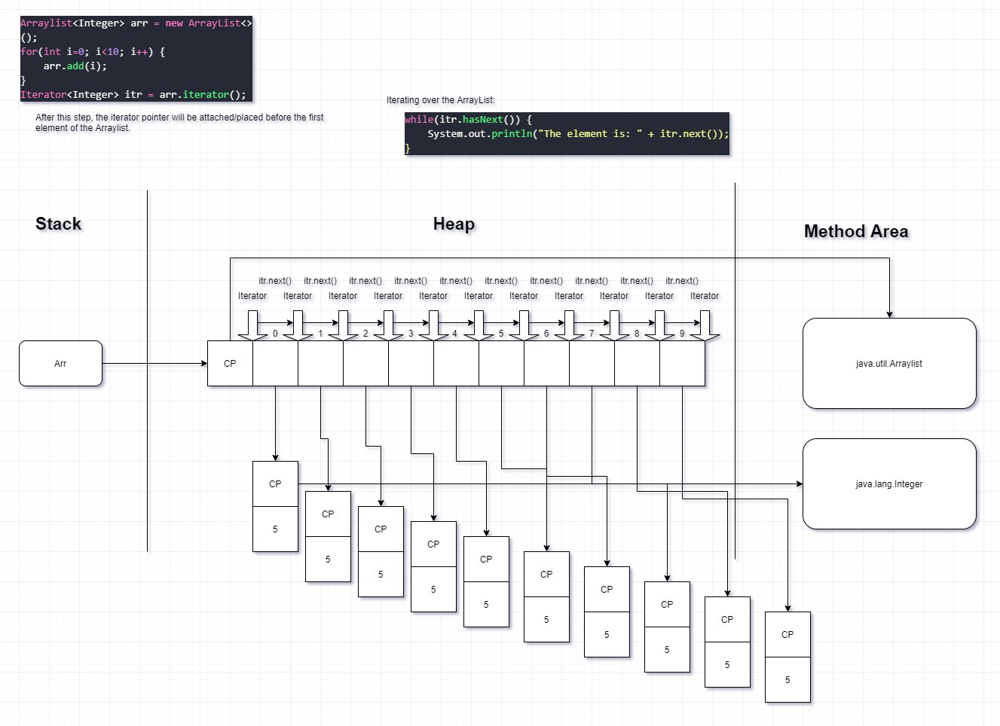

# Contents:

* [Iterators](#iterators)  
* [ListIterator](#listIterator)  

# Iterators:
<a name='iterators'></a>

- Iterators are not part of the collection framework, be is used extensively with collections.  
- With Iterators, we cannot just iterate over a collection, but also remove elements from the collection.  
- for-each loop with collections is nothing but an implicit iterator.  
- An iterator can be attached to all the List and Set imlementing classes as they are all extending Collection interface which is extending Iterable interface.  
- An iterator cannot be attached to Map implementing classes.  
- Iterator & ListIterator are fail-fast.  
- Attaching an Iterator to an ArrayList:
```java
Arraylist<Integer> arr = new ArrayList<>();
for(int i=0; i<5; i++) {
    arr.add(i);
}
Iterator<Integer> itr = arr.iterator();
```
- This places iterator(pointer) BEFORE 1st element the ArrayList.  
- Methods associated with Iterator interfaces:  
    - `boolean hasNext()`: Returns true if there exists next element, false otherwise. Does not advance the position of iterator.  
    - `E next()`: Returns the element next to iterator position and moves the position of the iterator before the next element.  
    - `void remove()`: Removes last returned element from iterator. Last element which was returned using the next method.  
- Code to showcase the above:  
```java
Arraylist<Integer> arr = new ArrayList<>();
for(int i=0; i<5; i++) {
    arr.add(i);
}
Iterator<Integer> itr = arr.iterator();
while(itr.hasNext()) {
    System.out.println("The element is: " + itr.next());
}
```

- Limitations:
    - Can move forward only  
    - Can only be attached before the first element of the collection.  

## How Iterator works:
The memory picture of how Iterator works with next() function:  
  

__NOTE:__ `Iterator<E>` is just an interface, and we are using a reference of it. The object to which the reference is pointing to is the implementing class of the Iterator interface. For an ArrayList, it'll be `java.util.ArrayList$Itr` which is a nested class within ArrayList. And this Itr class has implemented `java.util.Iterator` interface. When attaching the iterator to a LinkedList, the name of the class will be `java.util.LinkedList$Itr`.  

## Exceptions with Iterator/ListIterator:
1. `java.util.NoSuchElementException`: thrown whenever trying to access the elem beyond the size of list via Iterator/ListIterator  
2. `java.lang.IllegalStateException`: thrown whenever trying to remove an element before calling next(). That means remove() and next() methods go hand in hand.  
3. `java.util.ConcurrentModificationException`: thrown typically  when trying to use same iterator/list iterator after structrually modifying list(eg add/remove methods of list). This can happen most likely when working with multiple threads. While the producer can keep on producing the data in the Arraylist, it'll change the structure of the ArrayList, and thus the iterator won't be attached to the original Collection but an updated one.  Example(without using multiple threads):
```java
while(itr.hasNext()) {
    int n= itr.next();
    System.out.println(n);
    if (n==5) {
        arr.add(20);
    }
}
```
 __NOTE:__ This feature of the iterator is calles as fail-fast nature of the iterator. It's designed this way because if iterator was allowed to work after the structure of the collection changed, it would have given inconsistent or unpredictable results.  
 __NOTE(FROM JAVA DOCS):__ The iterators returned by this class's _iterator_ and _listIterator_ methods are fail-fast: if the list is structurally modified at any time after the iterator is created, in any way except through the iterator's own _remove_ or _add_ methods, the iterator will throw a `ConcurrentModificationException`. Thus, in the face of concurrent modification, the iterator fails quickly and cleanly, rather than risking arbitrary, non-deterministic behavior at an undetermined time in the future.  

## Exception while accessing element by index.

1. `java.lang.IndexOutOfBoundsException`: thrown typically while trying to access elem beyond size(0 to size-1) via get() method.  

# ListIterator:
- This is a sub interface of Iterator, and thus has the same methods of Iterator interface like `hasNext()`, `next()`, `remove()`, etc.  
- It is a list specific iterator and thus can only be attached to List implementing classes.  
- The method used to attach a ListIterator to a list is: `listIterator()`. It will return a `ListIterator<E>` kind of reference.  
- There is a second overloaded form of this method called `listIterator(int index)` which will attach the listIterator before the specified index.  
- This is a scrollable cursonr, which means using this we can traverse in both the directions, and not only one way like the iterator.  
- The APIs it takes from Iterator:
    - `boolean hasNext()`  
    - `E next()`  
    - `void remove()`  
- APIs it's adding in it's own:  
    - `boolean hasPrevious()`: Returns true if this list iterator has more elements when traversing the list in the reverse direction.  
    - `E previous()`: Returns the previous element in the list and moves the cursor position backwards.  
    - `int nextIndex()`: Returns the index of the element that would be returned by a subsequent call to next().  
    - `int previousIndex()`: Returns the index of the element that would be returned by a subsequent call to previous().  
    - `void set(E e)`: Replaces the last element returned by `next()` or `previous()` with the specified element (optional operation).  
__NOTE:__ In case of this, the type of the object that the `listIterator()` method returns is `java.util.ArrayList$ListItr`. And thus the nested class ListItr is the implementing class of the ListIterator interface.  
